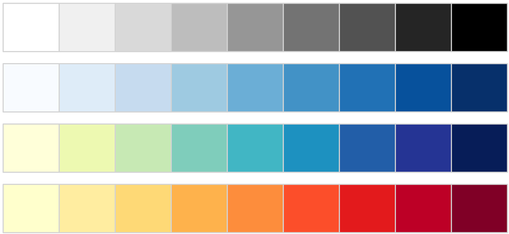
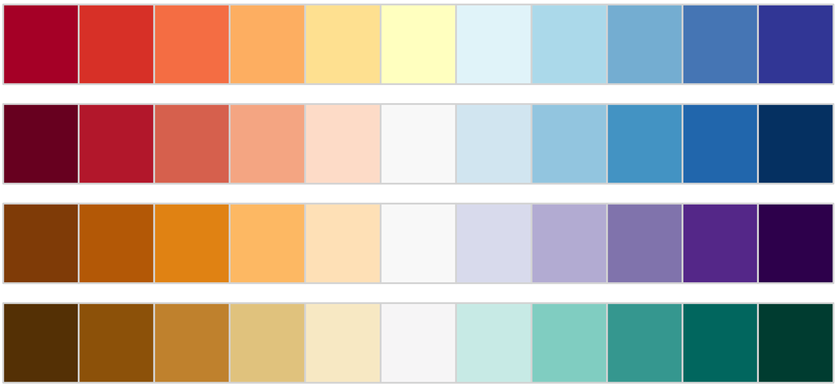
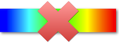
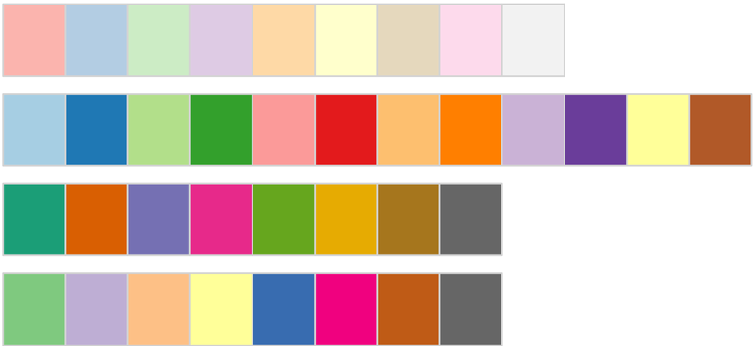
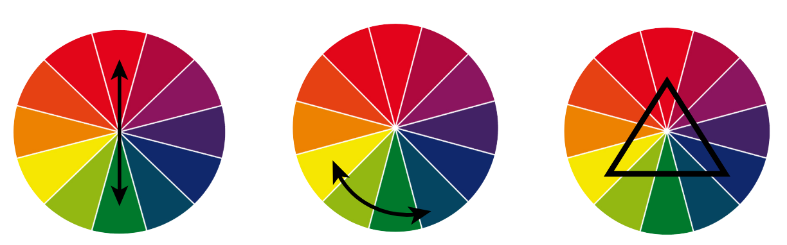

# Color palettes

Although it is often not given much attention, choosing the right color palette can make a significant difference in how our work is received. In general terms, when choosing a color palette we need to think about two main, and often competing, interests: __functionality__, and __aesthetics__.

##  Functionality

In science and engineering, the main objective should always be functionality. Most of the time we are trying to communicate difficult concepts to an audience that might not be that interested in figuring out the details of how to read the information we are trying to convey. In this sense, the first thing we have to take into account is wether we want to use a sequential, diverging, or categorical color palette.

### Sequential

Sequentiel palettes are great for data that does not require a broad spectrum of differentiation, or when the concepts it is trying to transmit is one-dimensional in nature (hot, cold, positive, negative quantities).

### Diverging

Diverging palettes are great for when the data range is wide, or represents competing concepts in the same graph (hot/cold, positive/negative).

It is important to keep the palette with the least amount of colors possible. An example of how not to define a diverging color palette follows:

This is because, from a viewers perspective, there is no clear relationship between the colors and the values. Despite it ranging through RGB colors, it is not clear which is a "low" value, and a "high" value given that green is in between them.

### Categorical

Categorical color palettes, as their name implies, are great for categorical data. An important note here is, that they should never be used for non-categorical representations because they are almost uninterpretable in those contexts.

##  Aesthetics

Although it is often neglected in science and engineering, aesthetics are important. Most of the default color palettes use some variation of the "complementary" (leftmost panel) or "triads" (rightmost panel) principle. This is a good way to make sure the colors are as differentiable as possible but, unfortunately, it does result in poor color combinations more often than not. A good compromise is to manually select colors that are "far apart enough", but that still match well with each other.

## Other Notes

### Colorblindness

##  Resources

* <a href="https://coolors.co/">Coolors</a>
* <a href="https://cran.r-project.org/web/packages/ggsci/vignettes/ggsci.html">Sci-Fi Color Palettes</a>
* <a href="http://colorbrewer2.org/#type=sequential&scheme=Blues&n=7">Color Brewer for Maps</a>
* <a href="http://colorpalettes.net/">Artistic Color Palettes</a>
