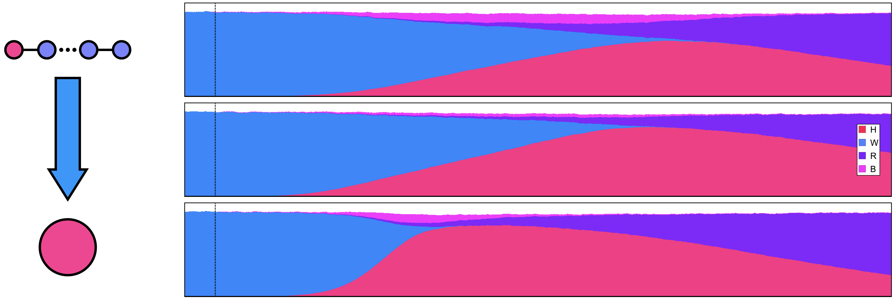

# Data Visualization Primer

## Why?

* To raise interest in our work
* To understand data
* To communicate information

## How?

## Constraints

###  Utility VS Attractiveness

###  Analysis VS Exploration

###  Static VS Dynamic

###  Print VS Digital

Although it is less often though about, there are still some constraints in the print media that make it
