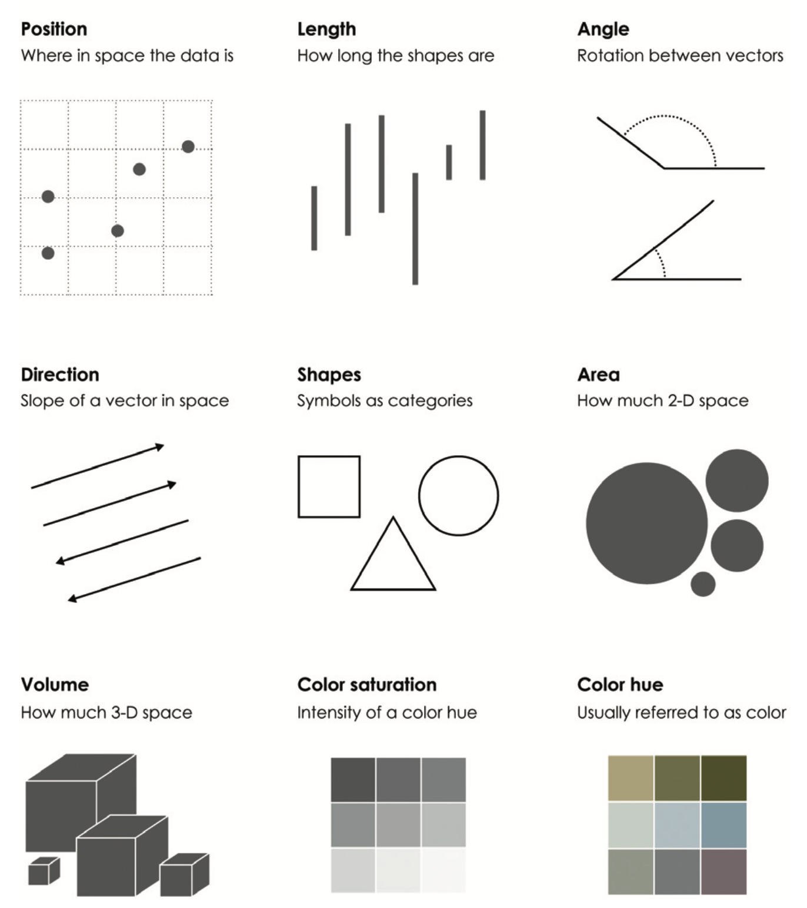
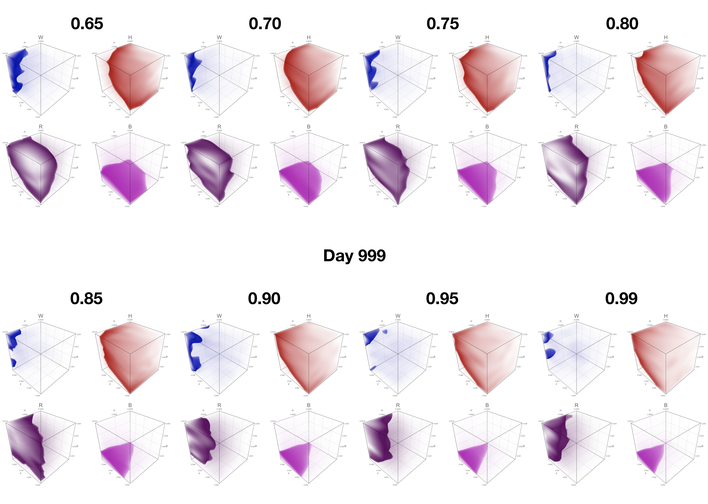
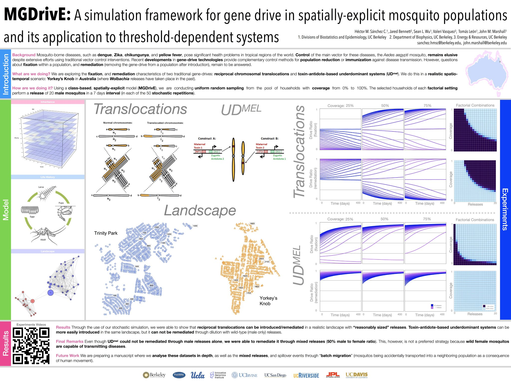

# Data Visualization Primer

<i>Good data visualization is time consuming.</i>

## Why?

* To raise interest
* To understand data
* To communicate

## How?

  

## Constraints

###  Utility VS Attractiveness

###  Analysis VS Exploration

###  Static VS Dynamic

###  Print VS Digital

Although it is less often though about, there are still some constraints in the print media that make it

### File Size VS Quality

## Telling a Story

