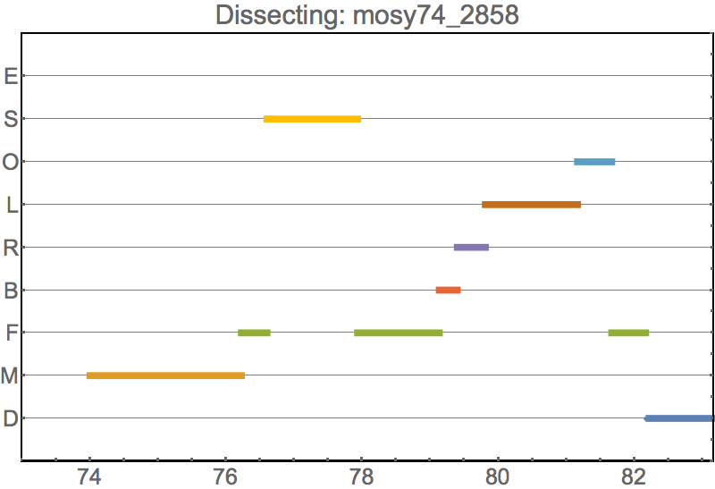
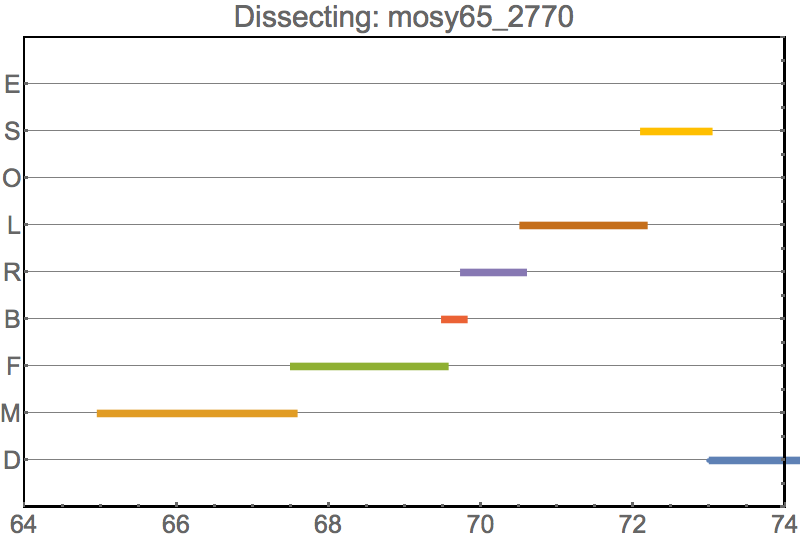
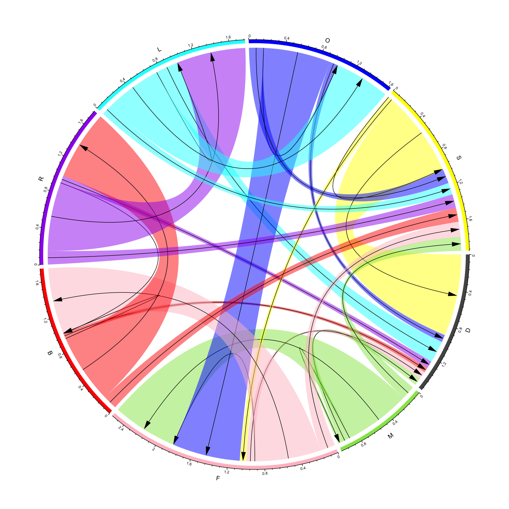

# Plot Types by Function

## Scatter

**Input:** *{x,y}* or *{x,y,z}* coordinates

### Extensions and Gallery

## Transitions Data

**Input data:** Transition matrices/Edges lists

### Heatmap

### Network

<a href="./media/uninterpretableChain.html">Chain</a>

### Chord Diagram

### Extensions and Gallery

Showing the spread of SIR diseases in a network.

## Radial

