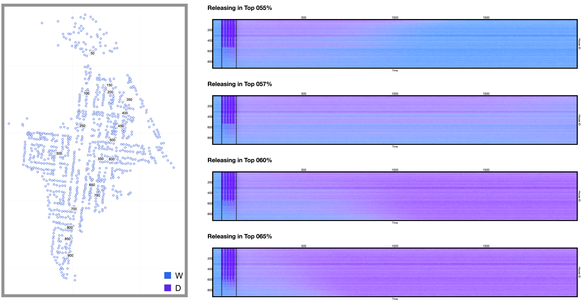
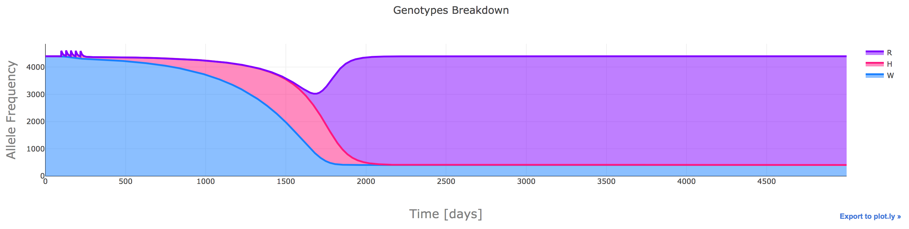
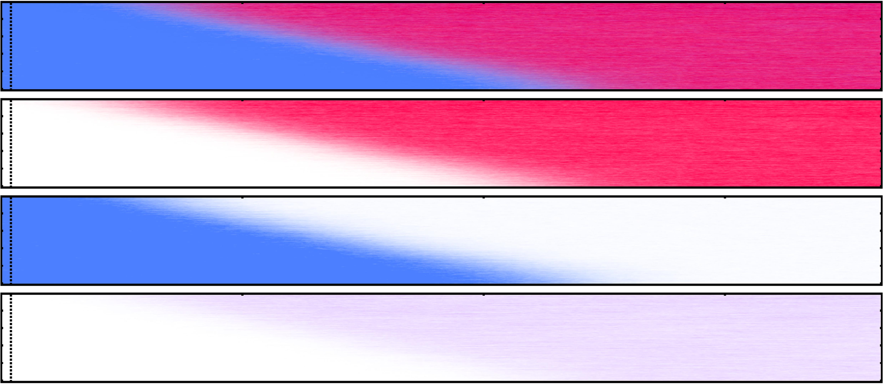
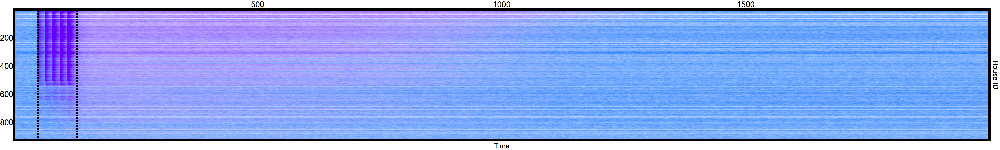

# Time Series

## Line Plots (connected scatter plots)

## Stream Chart (stacked area)

## Heatmap

# Exercises

1) In this exercise, we will use the data from a stochastic simulation of three mosquito genotypes interactions in a spatial landscape. Starting from datasets containing 50 repetitions of a stochastic experiment, we will create the following plot that allows the visualization of hundreds of traces, along with their mean in an easy to read format.

 

  <a href="https://github.com/Chipdelmal/dataViz_CADi/tree/master/Day01/scripts/TimeSeries">
    

  </a>

 

Click on the image to follow the link to the folder with the code.

2) In this exercise, we will use the aggregated data from a deterministic simulation of three mosquito genotypes interactions in a spatial landscape. We will generate the stacked area chart of the information in _plotly_ to create an interactive version of the

 

  <a href="https://github.com/Chipdelmal/dataViz_CADi/tree/master/Day01/scripts/StackedArea">
    

  </a>

 

Click on the image to follow the link to the folder with the code.

# Extensions and Gallery

Dissecting a mosquito life history:

Displaying spatio-temporal processes in a landscape:

