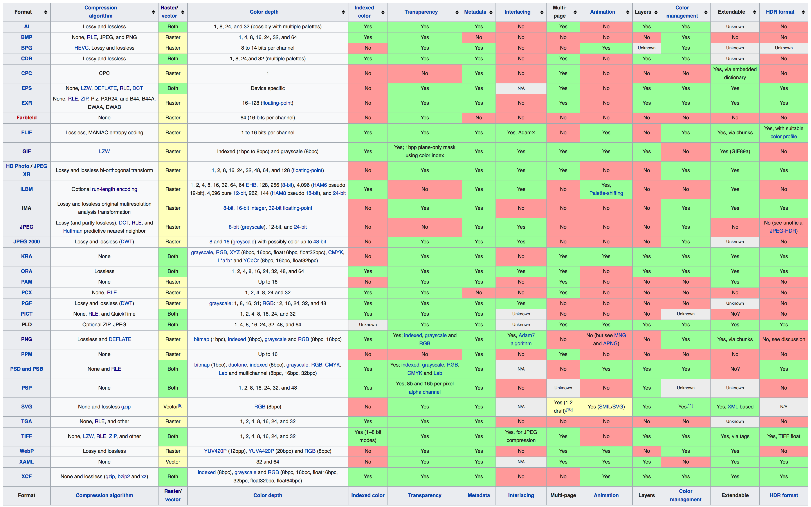
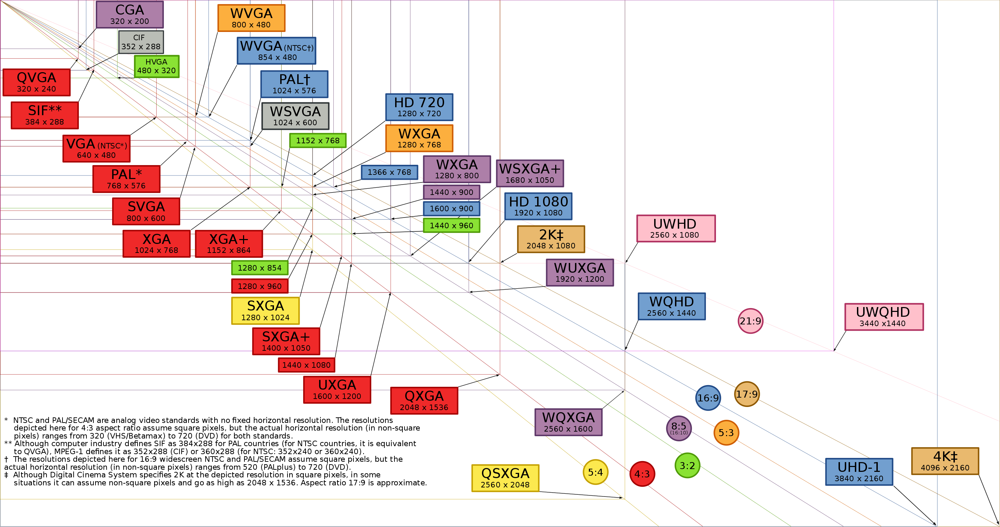

# Media Formats

## Image Formats

### Raster-based

JPEG/JFIF, JPEG 2000, Exif, TIFF, GIF, BMP, PNG, PPM/PGM/PBM/PNM, WebP, HDR, HEIF, BAT, BPG

#### [JPG, JPEG](https://en.wikipedia.org/wiki/JPEG)

Uses the lossy [discrete cosine transform](https://www.youtube.com/watch?v=Q2aEzeMDHMA) to achieve high compression rates. This format is good for digital photographs  as it generally allows compression rates of about 10:1 without any obvious quality loss. In terms of scientific visualizations, however, [JPEG](https://en.wikipedia.org/wiki/JPEG) is often a bad alternative due to the artifacts generated by the compression (specially in high contrast region of the image).

   
  
  
  
   

#### [PNG](https://en.wikipedia.org/wiki/Portable_Network_Graphics)

#### [TIFF](https://en.wikipedia.org/wiki/TIFF)

Tagged Image File Format can be used as a container for [JPEG](https://en.wikipedia.org/wiki/JPEG)s or lossless raster information along with vector data about boundaries, and croppings. This format was created to provide a common ground for scanners in mid 80's but has been extended and is popular in photography, and publishing industry.

One of the advantages of [TIFF](https://en.wikipedia.org/wiki/TIFF) over [JPEG](https://en.wikipedia.org/wiki/JPEG) is that it allows lossless compression algorithms such as: [PackBits](https://en.wikipedia.org/wiki/PackBits), [LZW](https://en.wikipedia.org/wiki/Lempel%E2%80%93Ziv%E2%80%93Welch), [ZIP](https://en.wikipedia.org/wiki/Zip_(file_format)), amongst others.

#### [GIF](https://en.wikipedia.org/wiki/GIF)

### Vector-based

CGM, Gerber format, SVG

#### SVG

### Compound

EPS, PDF, PS, PICT, WMF/EMF, SWF, XAML

## More information

For a more thorough comparison of various images formats look at this [link](https://en.wikipedia.org/wiki/Comparison_of_graphics_file_formats).

## Video Formats

### [MPEG](https://en.wikipedia.org/wiki/Moving_Picture_Experts_Group)

### [MP4](https://en.wikipedia.org/wiki/MPEG-4_Part_14)

### [MOV](https://en.wikipedia.org/wiki/QuickTime_File_Format)

### [MKV](https://en.wikipedia.org/wiki/Matroska)

Matroska video is a container format.
VLC player.

## [Screen Resolutions and Aspect Ratios](https://en.wikipedia.org/wiki/Display_resolution)

  
