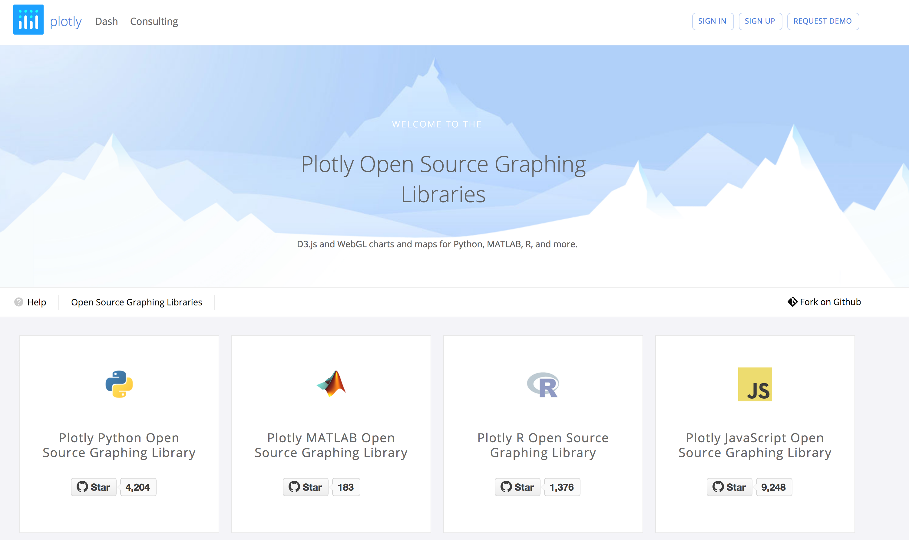

# [Plotly](https://plot.ly/graphing-libraries/)

Plotly is an extremely versatile graphing framework for _Python_, _R_, _Javascript_, and _Matlab_ (amongst others).

Some of the features that make Plotly stand out from other alternatives are:

* Portability
*  Aesthetics

## Use Examples

    

    
    

