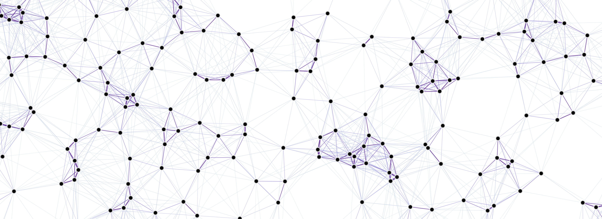
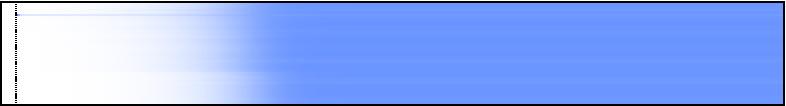
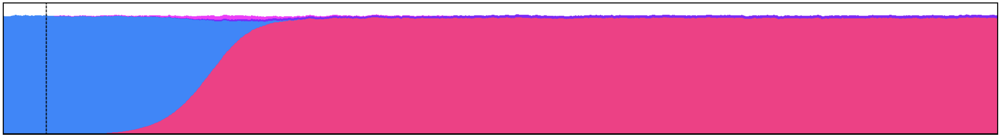
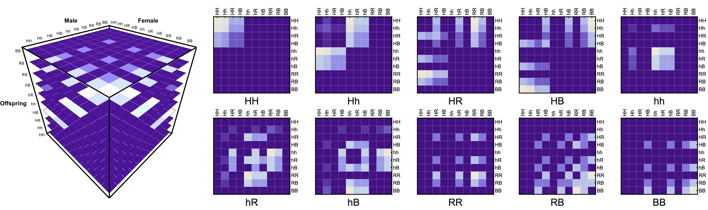

# dataViz CADi

This repository contains the materials for the "Data Visualization" three days intensive [CADi](http://sitios.itesm.mx/va/capacitacion/1_2.html) (["Cursos de Actualización en las Disciplinas"](http://sitios.itesm.mx/va/capacitacion/1_2.html)) course taught to professors at ["Tecnológico de Monterrey"](https://tec.mx/es) Institute. It hosts a compendium of materials and activities designed to develop and improve skills to make charts and plots more interactive/appealing, and to show some of the tools we can use to achieve better exposure of our work in scientific, and engineering applications.

  

## Requirements

Although not strictly required, having some knowledge on one of the following programming languages is suggested (as we'll be using them throughout the course):

* [Mathematica](http://www.wolfram.com/mathematica/): Most of the graphics showcased in the website were developed in this platform due to its flexibility in terms of graphical capabilities (as well as personal preference of the teacher).
* [Python](https://www.python.org/): One of the most popular programming languages. Some of the more versatile data visualization frameworks are compatible with it.
* [R](https://www.r-project.org/): A popular statistical framework with lots of community support.

  

There's examples developed in each of the platforms according to the application and availability of frameworks for specific tasks.

Additionaly, it is also suggested to have the [atom](https://atom.io/) text editor for the markdown and python examples. For a useful guide on how to install R and Python kernels in Atom follow this [link](https://jstaf.github.io/2018/03/25/atom-ide.html). Some other useful packages for development in atom are:

* [Markdown Preview Enhanced](https://atom.io/packages/markdown-preview-enhanced): Allows the live update of markdown documents previews.
* [Hydrogen](https://atom.io/packages/hydrogen): Package that allows running Python code in [Jupyter](http://jupyter.org/)-style from within atom.
* [Preview HTML](https://atom.io/packages/atom-html-preview): Allows us to view the results of our HTML within atom.
* [Platformio-ide-terminal](https://atom.io/packages/platformio-ide-terminal): Launches a terminal instance from within atom (the session starts at our current directory).

It is also suggested to install the [RStudio](https://www.rstudio.com/) IDE for R development and the [github desktop app](https://desktop.github.com/) to for the repository.

  

## Contents

Given that the course is intended to be useful for several disciplines, the workshop was created with flexibility in mind. As such, modules are fairly independent and can be taken in different order.

### Day 01 (8h)

<b>Goal:</b> To describe the basic principles of data visualization, the types of plots that better describe certain datasets, and perform some common data visualization examples that are common across different fields.

1. [Introduction](./markdowns/intro.md): Objectives, Scope, My background, Software Installation
2. [Data Visualization Primer](./markdowns/dataVizPrimer.md): Data visualization workflow
3. [Mathematica/R/Python Primer](./markdowns/programmingPrimer.md): Brief introduction to programming languages
4. [Media Formats](./markdowns/formats.md): Raster-based, Vector-based
5. [Plot Types (first part with exercises)](./markdowns/plotTypes.md): Counts, Scatter, Time Series
6. [Data Handling/Data Sources](./markdowns/dataHandlingAndDataSources.md): Data Formats, Data Handling Frameworks

  

### Day 02 (8h)

<b>Goal:</b> To describe and run through some examples of popular data visualization frameworks in R and Python.

1. [Working with Python and Anaconda](./markdowns/pythonAndAnaconda.md): Setting up, Basics, VirtualEnv, Anaconda, Jupyter, Spyder, Atom
2. [Colors](./markdowns/colors.md): Color Palettes
3. [Plot Types (second part with exercises)](./markdowns/plotTypes.md): Time Series, Transitions, Clustering, Factorial, Multidimensional, Geographic
4. [Good Practices](./markdowns/goodPractices.md): Suggestions to make data visualization clearer
<!--5. [Some Mainstream Visualization Frameworks](./markdowns/frameworks.md): ggplot, plotly, D3js-->

  

### Day 03 (8h)

<b>Goal:</b> To be able to put together a project website and host some of the examples created throughout the course for better exposure of our work.

1. [Github Introduction](./markdowns/github.md): Introduction to github, setting up an account, and our first repository
2. [Markdown + HTML Primer](./markdowns/markdown.md): Introduction to MD and HTML for github and presentations
3. [gh-pages](./markdowns/ghPages.md): Github pages, "Docs" folder, "gh-pages" branch
4. [Remark](./markdowns/remark.md): One of the frameworks to create simple markdown presentations
5. [Revealjs](./markdowns/revealjs.md): MathJax-supported javascript HTML presentations framework
6. [ffmpeg](./markdowns/ffmpeg.md): Stop-motion animations, Further video editing

  

## Resources

This is a list of complementary sources and tools that are useful in data visualization applications.

### Tools

* [anaconda](https://www.anaconda.com/): DataScience/Package manager platform for python and R
* [atom](https://atom.io/): Versatile IDE for R, Python, Markdown, Javascript, amongst others
* [ffmpeg](https://www.ffmpeg.org/): Video Manipulation command line tool (can be used to create "stop-motion" animations)
* [ggplot2](https://cran.r-project.org/web/packages/ggplot2/ggplot2.pdf): Plotting in R
* [gimp](https://www.gimp.org/): Free "photoshop" alternative
* [github pages](https://pages.github.com/): Github pages
* [irkernel](https://irkernel.github.io/installation/): R kernel for jupyter
* [jekyll](https://jekyllrb.com/): Blog-like templates for github pages (Ruby)
* [jupyter](https://jupyter.org): Jupyter project
* [leaflet](https://leafletjs.com/): Open-source JavaScript library for interactive maps
* [matplotlib](https://matplotlib.org/): Python plotting framework
* [mathjax](https://www.mathjax.org/): Use latex in html documents through javascript
* [networkD3](https://christophergandrud.github.io/networkD3/): R Network Plotting
* [plotly](https://plot.ly/): Interactive plots (both in R, and Python)
* [python](https://www.python.org/): General-purpose programming language
* [R](https://www.r-project.org/): Statistical computing programming language
* [RColorBrewer](https://www.rdocumentation.org/packages/RColorBrewer/versions/1.1-2/topics/RColorBrewer): Color palettes for R
* [remark](https://github.com/gnab/remark): Markdown presentations
* [replit](https://repl.it/): Online python environments project
* [revealjs](https://revealjs.com/#/): Javascript presentations
* [rStudio](https://www.rstudio.com/): R IDE
* [sciweavers](http://www.sciweavers.org/free-online-latex-equation-editor): Latex to image converter to embed them into markdown
* [shiny](http://shiny.rstudio.com/): Interactive web development though R
* [slides](https://slides.com/): GUI for revealjs
* [spyder](https://www.spyder-ide.org/): "RStudio"-like IDE for Python
* [tydiverse](https://www.tidyverse.org/): Collection of R packages designed for data science.

### Online

* Coolors Color Palettes: https://coolors.co
* Colorpicker for Data: http://tristen.ca/hcl-picker/#/hlc/6/1/657D9F/E2E062
* Data Visualization Catalogue: https://datavizcatalogue.com/index.html
* Data Visualization Ted Talks: https://www.ted.com/playlists/201/art_from_data
* Flowing Data: https://flowingdata.com/
* Google Charts: https://developers.google.com/chart/interactive/docs/
* Markdown Cheatsheet: https://github.com/adam-p/markdown-here/wiki/Markdown-Cheatsheet
* Markdown Specs: https://github.github.com/gfm/
* Observable: https://beta.observablehq.com/
* OpenVis Conf 2018 Keynote: https://www.youtube.com/watch?time_continue=298&v=yeC9v-iHJu0
* Plots and Charts Galleries: https://datavizproject.com/
* Plot Type Selector: http://chartmaker.visualisingdata.com/
* The R Graph Gallery: https://www.r-graph-gallery.com
* The Python Graph Gallery: https://python-graph-gallery.com/
* The Truthful Art: https://truth-and-beauty.net/

### Books

* [Adams, S., & Helfand, J. (2017). The designer’s dictionary of color. 9781419723919](https://www.amazon.com/Designers-Dictionary-Color-Sean-Adams/dp/141972391X/ref=sr_1_1?ie=UTF8&qid=1540755233&sr=8-1&keywords=the+designers+dictionary+of+color)
* [Barabasi, Albert (2016). Network Science.](http://networksciencebook.com/)
* [Cairo, Alberto (2016). The truthful art: data, charts, and maps for communication.  ISBN-13: 978-0321934079 ](http://www.thefunctionalart.com/p/the-truthful-art-book.html)
* [Foster Provost, Tom Fawcett. Data science for business.](http://shop.oreilly.com/product/0636920028918.do)
* [Géron, Aurélien. Hands-On Machine Learning with Scikit-Learn and TensorFlow: Concepts, Tools, and Techniques to Build Intelligent Systems](http://shop.oreilly.com/product/0636920052289.do)
* [Hastie, Trevor. An Introduction to Statistical Learning with Applications in R](https://www.springer.com/gp/book/9781461471370)
* [Kabacoff, Robert. R in Action: Data Analysis and Graphics with R.](https://www.amazon.com/Action-Data-Analysis-Graphics/dp/1617291382)
* [Kirk, A. (2016). Data Visualisation: A Handbook for Data Driven Design. ISBN-13: 978-1473912144](http://www.visualisingdata.com/book/)
* [McKinney, W. Python for Data Analysis - Data Wrangling with Pandas, Numpy and Python. (2018). ISBN-13: 1491957662](https://www.amazon.com/Python-Data-Analysis-Wrangling-IPython/dp/1491957662/ref=asc_df_1491957662/?tag=hyprod-20&linkCode=df0&hvadid=312140868236&hvpos=1o1&hvnetw=g&hvrand=2146894602476699957&hvpone=&hvptwo=&hvqmt=&hvdev=c&hvdvcmdl=&hvlocint=&hvlocphy=9032076&hvtargid=pla-396828636441&psc=1)
* [Newman, Mark (2010). Networks: An Introduction.  ISBN-13: 978-0199206650.](https://www.amazon.com/Networks-Introduction-Mark-Newman/dp/0199206651)
* [Wellin, Paul (2016). Essentials of Programming in Mathematica. ISBN-13: 978-1107116665 ](https://www.amazon.com/Essentials-Programming-Mathematica%C2%AE-Paul-Wellin/dp/110711666X)
* [Yau, N. (2011). Visualize this : the FlowingData guide to design, visualization, and statistics. Wiley Pub. ISBN-13: 978-0470944882](https://flowingdata.com/books/)
* [Yau, N. (2013). Data points: visualization that means something. ISBN-13: 978-1118462195](https://flowingdata.com/books/)

### [Ph.D. Héctor Manuel Sánchez Castellanos](https://chipdelmal.github.io/)

* Contact: [ sanchez.hmsc@berkeley.edu | chipdelmal@gmail.com ]
* My main projects: [ [MGDrivE](https://marshalllab.github.io/MGDrivE/) & [MoNeT](https://chipdelmal.github.io/MoNeT/) ]
* My personal website: [ [chipdelmal.github.io](https://chipdelmal.github.io/) ]

 
