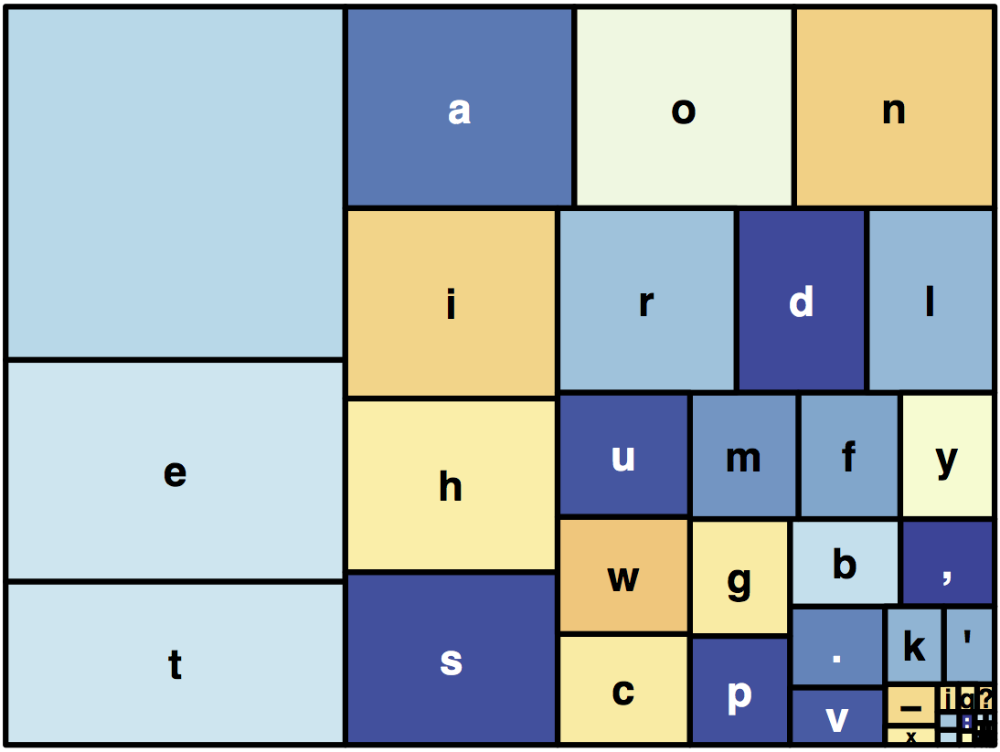
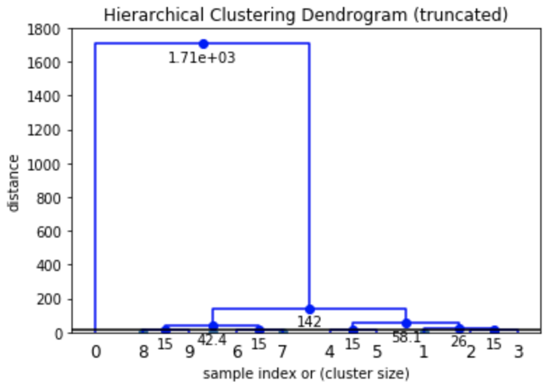

# Clustering

**Input:** *grouped data*

Clustered data is becoming more common due to the abundance of clustering algorithms emerging from several disciplines. Finding common patterns and motifs within datasets is a frequent exploratory step in data analysis workflows.

## Treemap

A tree map is a good representation of hierarchical data when we want to make comparisons of frequencies across different sets of elements. It provides the means to do

## Clustered Network

A good alternative for situations in which we are interested in both the clustering, and the transitions between elements.

## Dendrogram

Traditionally used in genetic analyses, these plots are useful in hierarchical clustering applications, as they naturally represent increasing levels of data groupings.

# Exercises

1. <a name="exercise01">[Tree Map (R)](./scripts/TreeMap)</a>
1. <a name="exercise02">[Random Networks (Mathematica)](./scripts/NetworksRandom)</a>

# Gallery

## Mosquito to Human Bites Clustered Network

