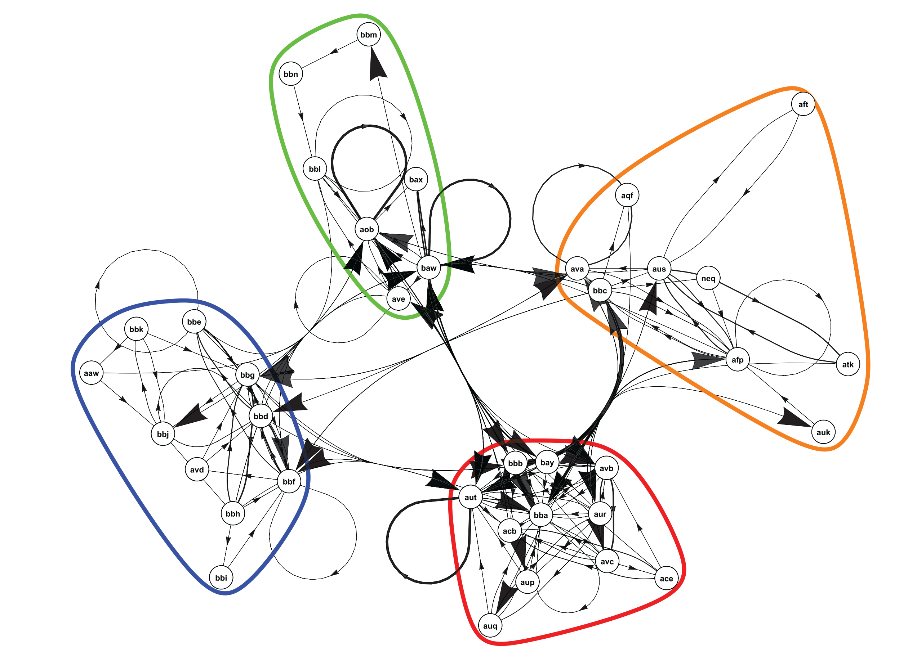
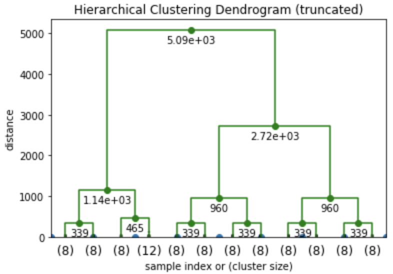

# Clustering

**Input:** *grouped data*

Clustered data is becoming more common due to the abundance of clustering algorithms emerging from several disciplines. Finding

## Treemap

## Clustered Network

## Dendrogram

# Exercises

1. <a name="exercise01">[Tree Map (R)](https://github.com/Chipdelmal/dataViz_CADi/tree/master/scripts/TreeMap)</a>

# Gallery

## Mosquito to Human Bites Clustered Network

