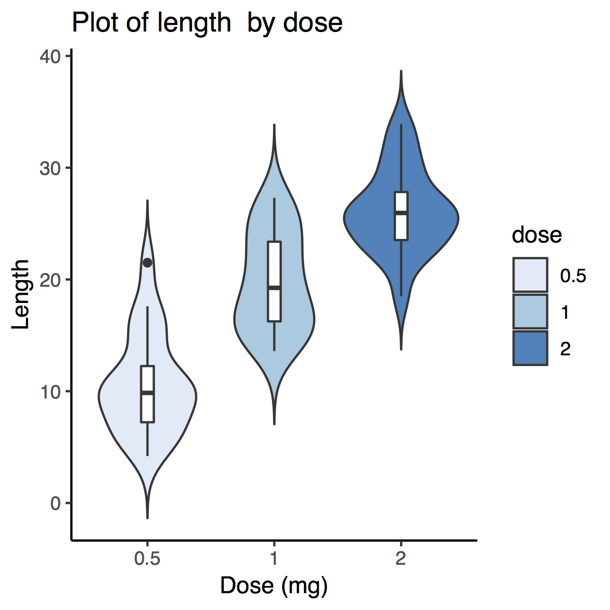
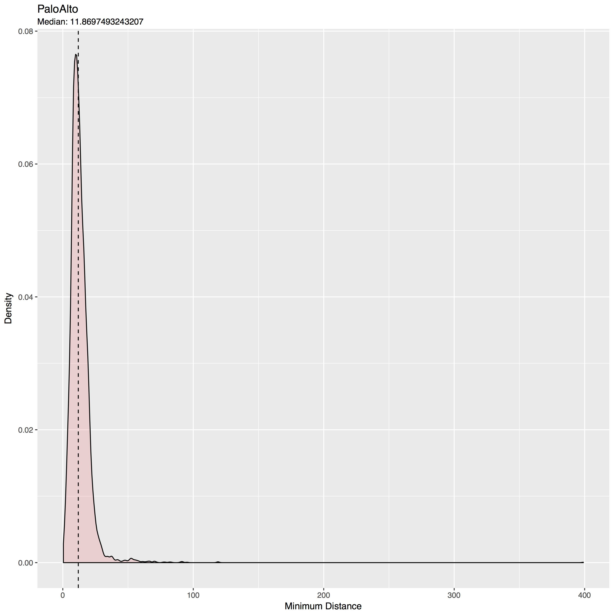
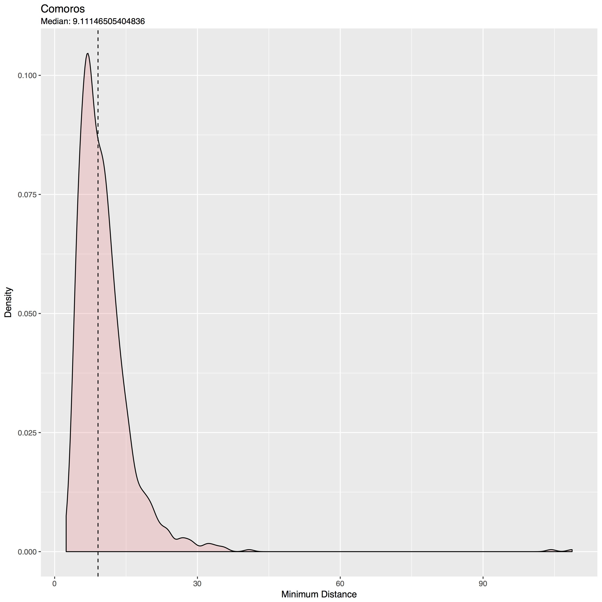
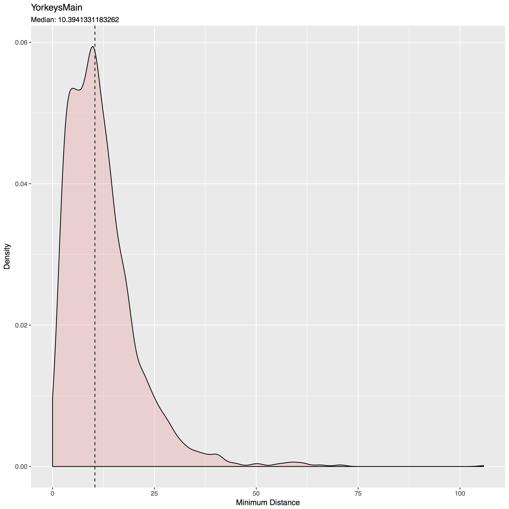

# Counts

**Input:** *{counts}* or *{time,counts}* coordinates

## Histograms and Smooth Histograms

## Box Whisker Charts

## Violin Plot

  

# Extensions and Gallery

## Displaying the minimum distances between households

  
