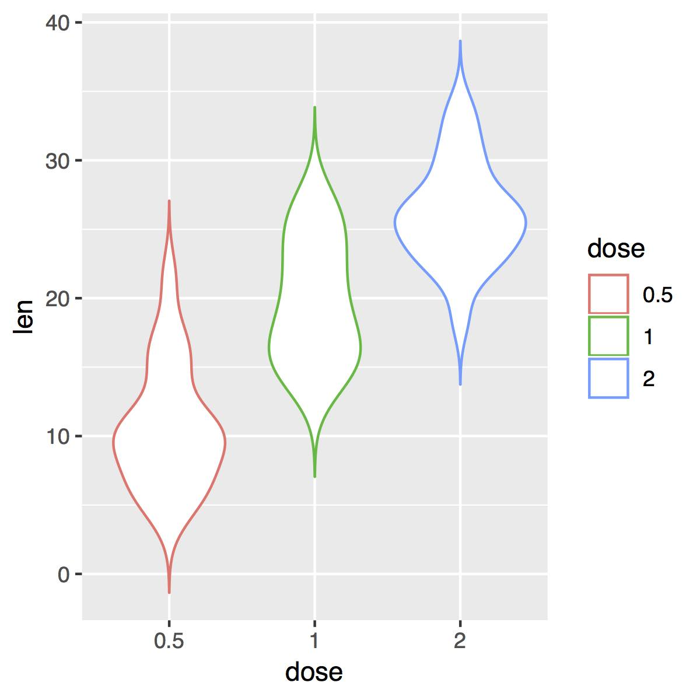

# Counts

**Input:** *{categorical counts}* coordinates

Counts of categorical data are common in statistical and clinical studies. Visualizing these data in an informative way is usually a good first step towards understanding the underlying processes that might be causing or disrupting patterns. For this reason, special care has to be taken when creating these plots, as it might affect our own perception of the phenomena under study.

## Histograms and Smooth Histograms

Histograms are the most natural way to show a distribution of data. These two alternatives will feel familiar to any viewer, and are usually worth including whenever they are appropriate.

## Box Whisker Charts

One of the most widely used plots for counts data is the "box-whisker" chart. This representation shows the quantiles of our counts, along with the median and, sometimes, the outliers. [Exercise 1](#exercise01) shows how to create a box-whisker chart with outliers.

 

## Violin Plot

Violin plots, like box-whisker charts, show the distribution of frequencies of count data with the advantage of also showing the shape of the distribution (not only the quantiles). This, however comes at the cost of some readability (some viewers are not that used to these data representations). [Exercise 2](#exercise02) will show us how to display data in this kind of graphics.

  

# Exercises

1. <a name="exercise01">[Box-Whisker Chart (R)](https://github.com/Chipdelmal/dataViz_CADi/tree/master/scripts/BoxWhiskerChart)</a>
2. <a name="exercise03">[Violin Plots (R)](https://github.com/Chipdelmal/dataViz_CADi/tree/master/scripts/ViolinPlots)
3. <a name="exercise03">[Histogram and Smooth Histogram (Mathematica)](https://github.com/Chipdelmal/dataViz_CADi/tree/master/scripts/ViolinPlots)

# Gallery

## Displaying the minimum distances between households

  
