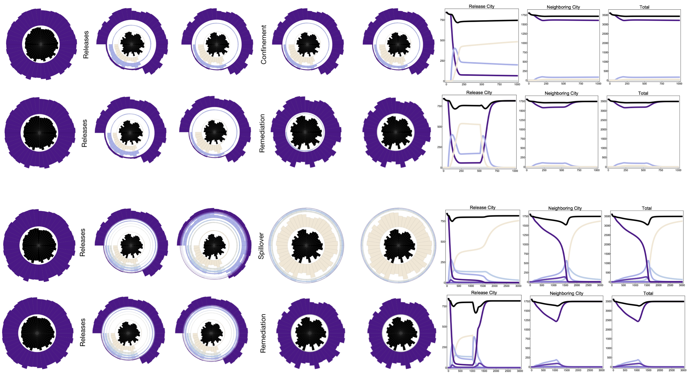

# Introduction

## My Background

### Studies

####  BSc Mechatronics Engineering

 

####  PhD Computer Science

 

### Postdoc Biostatistics/Epidemiology

 

### Industry and Research

#### Volvo: Trainee/Consultant

#### ININ: Research Internship

#### Institute of Health Metrics Evaluation: External Consultant

###  Current Research

#### [MGDrivE](https://marshalllab.github.io/MGDrivE/)

   

#### [MoNeT](https://chipdelmal.github.io/MoNeT/)

   

#### [MBITES](https://smitdave.github.io/MASH-Development/)

   

## More information

Take a look at my [personal website](https://chipdelmal.github.io/), [ResearchGate](https://www.researchgate.net/profile/Hector_Sanchez_Castellanos), or [github](https://github.com/Chipdelmal) for more information about the projects I'm currently involved with!

