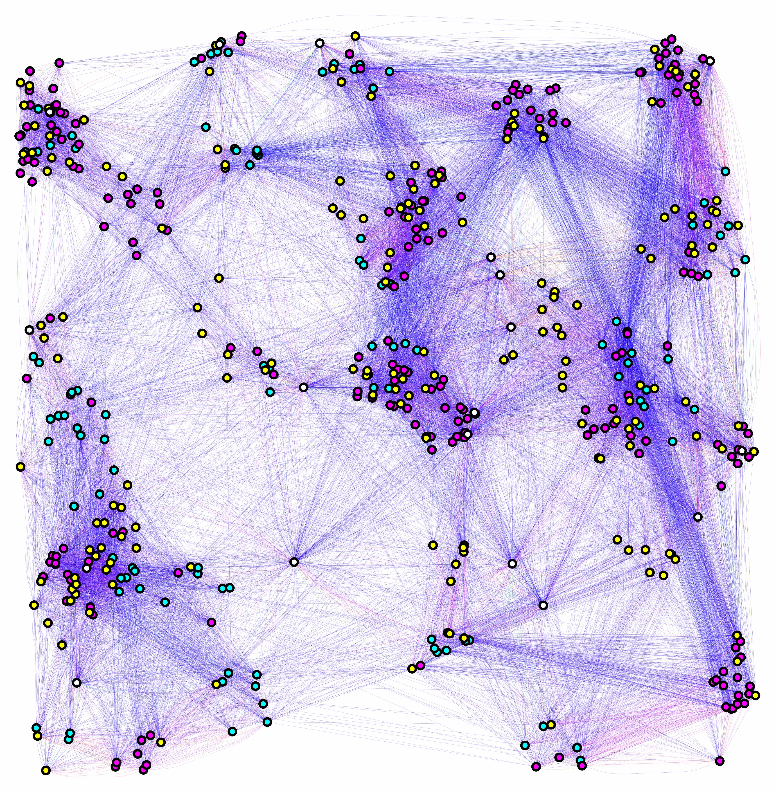

# My Background

## Studies

###  BSc Mechatronics Engineering

 

###  PhD Computer Science  

<iframe width="560" height="315" src="https://www.youtube.com/embed/trpYAquSXLc" frameborder="0" allow="accelerometer; autoplay; encrypted-media; gyroscope; picture-in-picture" allowfullscreen></iframe>

###  Postdoc Biostatistics/Epidemiology

 

<iframe width="560" height="315" src="https://www.youtube.com/embed/xNpVog_X8aY" frameborder="0" allow="accelerometer; autoplay; encrypted-media; gyroscope; picture-in-picture" allowfullscreen></iframe>

  

### Industry and Research

#### Volvo: Trainee/Consultant

#### ININ: Research Internship

#### Institute of Health Metrics Evaluation: External Consultant

##  Current Research

### [MGDrivE](https://marshalllab.github.io/MGDrivE/)

  

<iframe width="560" height="315" src="https://www.youtube.com/embed/WUFyyF5xc4Y" frameborder="0" allow="accelerometer; autoplay; encrypted-media; gyroscope; picture-in-picture" allowfullscreen></iframe>
</a> 

### [MoNeT](https://chipdelmal.github.io/MoNeT/)

 

### [MBITES](https://smitdave.github.io/MASH-Development/)

 

## More information

Take a look at my [personal website](https://chipdelmal.github.io/), [ResearchGate](https://www.researchgate.net/profile/Hector_Sanchez_Castellanos), or [github](https://github.com/Chipdelmal) for more information about the projects I'm currently involved with!

