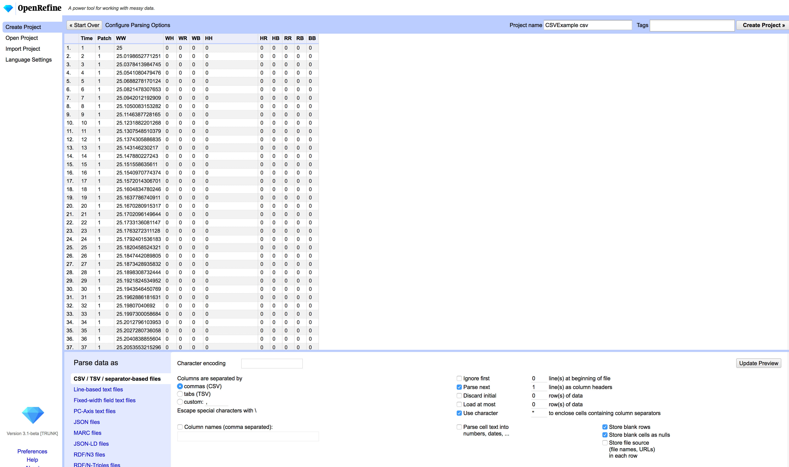
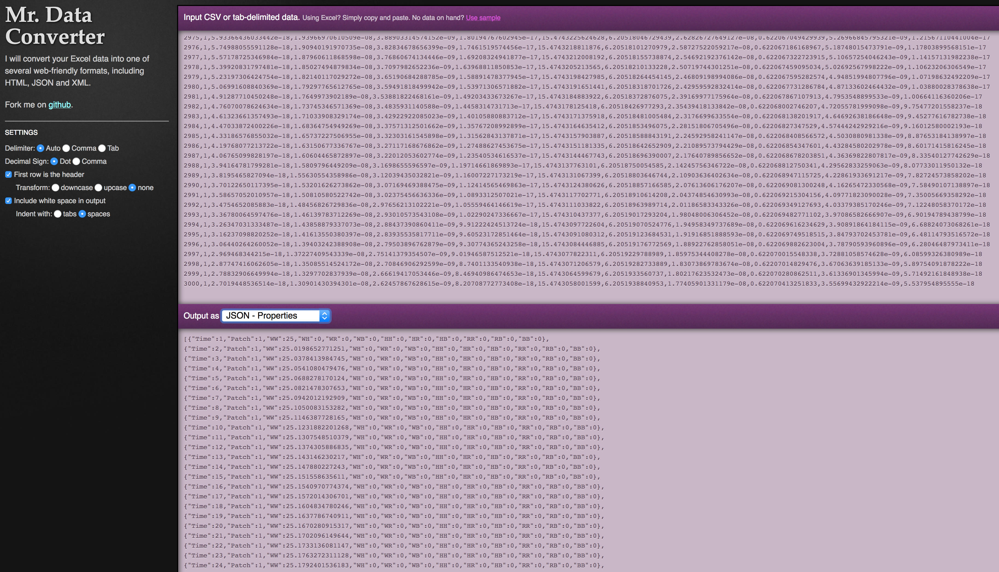
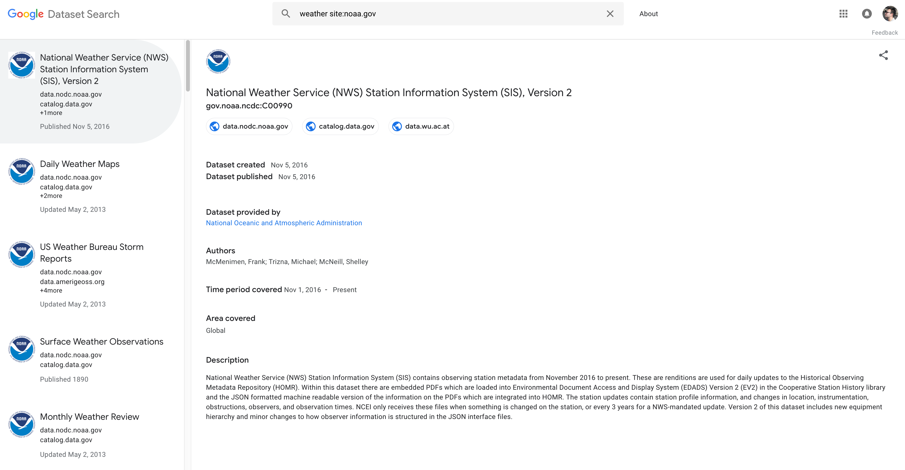

# Data Handling and Data Sources

Nearly every data visualization project starts with some combination of data gathering-cleaning-parsing. These combinations of activities are usually domain-specific, and sometimes even application-specific. As such, we can't cover this bread subject in a data-visualization course. We will focus on some of the main formats, and related activities. As well as provide as some tools/resources that could be useful for people in the future.

<hr>

## Data Sharing Formats

Several data formats exist depending on the specific field of study, and applications we are working on. Geographic data, genetics, mathematics, each field has its own set of preferred data sources and formats. It is impossible to cover them all, but some of the most common ones across fields are: [CSV/TSV](https://en.wikipedia.org/wiki/Comma-separated_values), [XML](https://en.wikipedia.org/wiki/XML), and [JSON](https://en.wikipedia.org/wiki/JSON).

### [CSV/TSV](https://en.wikipedia.org/wiki/Comma-separated_values)

Most prevalent data format. Stores information in a tabular way in which each slot in an entry is separated by a comma, "tab" or by a custom separator symbol; and each entry is a row in the plain text file.

The main drawback of CSV is its lack of support for highly structured data/different levels of aggregation.

```
Patch,WH,WR,WB,HH,HR,HB,RR,RB,BB
1,25,0,0,0,0,0,0,0,0
2,24.47,0,0,0,0,0,0,0,0
3,24.48,0,0,0,0,0,0,0,0
4,24.36,0,0,0,0,0,0,0,0
5,24.43,0,0,0,0,0,0,0,0
6,24.44,0,0,0,0,0,0,0,0
7,24.35,0,0,0,0,0,0,0,0
8,24.23,0,0,0,0,0,0,0,0
9,24.38,0,0,0,0,0,0,0,0
10,24.27,0,0,0,0,0,0,0,0
...
20,25.53,0,0,0,0,0,0,0,0
21,25.48,0,0,0,0,0,0,0,0
22,25.62,0,0,0,0,0,0,0,0
```


### [XML](https://en.wikipedia.org/wiki/XML)

It's main goal is to create a documents markup language that is readable for both: humans and computers. Despite it being designed for documents, it is widely used for data-storage.

XML's main criticisms stem from two main branches: it's extreme verbosity (which leads to large file sizes), and the difficulty to store "unravel" the tree of the data to share across applications.

```
<experiment>
	<header>
		<title>Novel Control Measures.</title>
		<author>HMSC</author>
		<date>09:51:08.060 PM 22-Jun-2016</date>
		<description>Replicating RIDL/Wolbachia papers in smaller scale.</description>
	</header>
	<parameters>
		<parameter id="SecondsPerTick">300</parameter>
		<parameter id="ScenarioNumber">GMap</parameter>
		<parameter id="Temperature">25</parameter>
		<parameter id="BreedingZonesNumber">GoogleMap</parameter>
		<independent id="HUMAN_VISITING_PROBABILITY">2.88E-4</independent>
	</parameters>
	<ticks_outputs>
		<tick id="28944">
			<output id="MosquitoPopulation">3765</output>
			<output id="EggsPopulation">2833</output>
			<output id="LarvaPopulation">395</output>
			<output id="PupaPopulation">88</output>
			<output id="AdultPopulation">449</output>
			<output id="WolbachiaPopulation">0</output>
			<output id="SterilePopulation">0</output>
			<output id="FitnessPopulation">0</output>
			<output id="OxitecPopulation">0</output>
			<output id="EggDeathByInhibition">0.01005041875439575</output>
			<output id="LarvaDeathByDensity">9.398346146001782E-4</output>
			<output id="Temperature">25</output>
			<output id="FemalePopulation">197</output>
		</tick>
    ...
   </ticks_outputs>
</experiment>
```

### [JSON](https://en.wikipedia.org/wiki/JSON)

Human-readable data transmission format based on "attribute-value" pairs and arrays (or serializable formats) to store data.

```
[{
  "id": [2],
  "tile": [1],
  "time": [0, 0, 0],
  "sites": [34, 54, 54],
  "search": [true, false, false],
  "behavior": ["B", "B", "D"],
  "cod": ["surviveFlight"],
  "bloodHosts": [0],
  "timeFeed": [0],
  "siteFeed": [0],
  "probeAndFeed": [false],
  "ovipositionTimes": [0],
  "ovipositionSites": [0],
  "ovipositionBatchSize": [0]
},
...
{
  "id": [45],
  "tile": [1],
  "time": [0, 0.4553, 0.4553, 0.4553],
  "sites": [4, 34, 31, 31],
  "search": [true, true, false, false],
  "behavior": ["B", "B", "B", "D"],
  "cod": ["surviveFlight"],
  "bloodHosts": [0],
  "timeFeed": [0],
  "siteFeed": [0],
  "probeAndFeed": [false],
  "ovipositionTimes": [0],
  "ovipositionSites": [0],
  "ovipositionBatchSize": [0]
}]
```

<hr>

## Data Cleaning/Wrangling

Tedious and unappreciated task of gathering the data we need to analyze, and processing it to make it consistent/usable.

### Custom Scripts

Most flexible way to do data wrangling, albeit time-consuming. Python is specially useful in these activities due to its easy to learn syntax, and thorough documentation, and [resources](https://www.amazon.com/Python-Data-Analysis-Wrangling-IPython/dp/1491957662/ref=asc_df_1491957662/?tag=hyprod-20&linkCode=df0&hvadid=312140868236&hvpos=1o1&hvnetw=g&hvrand=2146894602476699957&hvpone=&hvptwo=&hvqmt=&hvdev=c&hvdvcmdl=&hvlocint=&hvlocphy=9032076&hvtargid=pla-396828636441&psc=1).

```python
def compileFactorialCSVFromFiles(path, outFilename):
    files = os.listdir(path)
    filenames = [
        path + name for name in files if fnmatch.fnmatch(name, 'E_*.csv')
    ]
    f = open(path+outFilename, 'wb')
    for file in filenames:
        fileData = np.genfromtxt(file, skip_header=1, delimiter=",")
        np.savetxt(f, fileData, fmt='%2.5f', delimiter=",")
    f.close()
```


### [OpenRefine](http://openrefine.org/)


<a href="http://openrefine.org/">

</a>

### [Mr. Data Converter](https://shancarter.github.io/mr-data-converter/)

<a href="https://shancarter.github.io/mr-data-converter/">

</a>

<hr>

##  Some Useful Data Sources

### [OpenStreetMap](https://www.openstreetmap.org/#map=16/37.8689/-122.2681)

<a href="https://www.openstreetmap.org/#map=16/37.8712/-122.2598">

</a>

### [Google Dataset](https://toolbox.google.com/datasetsearch)

<a href="https://toolbox.google.com/datasetsearch">

</a>

### [CICESE](https://www.cicese.edu.mx/)

<a href="https://www.cicese.edu.mx/">

</a>
