# Data Visualization Primer

The importance of good data visualization is often neglected when thinking about experiments and timelines. This, however, is often a costly oversight as it is what tends to attract more attention when presenting our results. Unfortunately, <b>good data visualization is time consuming</b>. Unless there is a hired data analyst/graphics designer (which is often not the case), we'll have to deal with doing or data visualization ourselves. This might come off as a somewhat daunting endeavor given that the guidelines that make a "good" scientific graphic are fuzzy or close to nonexistent. Things like color palettes, font faces, distribution of elements, thicknesses, opacities, all affect the overall perception of our work. This is on top of selecting the right plot-type, and the correct framework to work in. As such, it is a good idea to review and practice some of the most current trends and technologies in the subject.


<hr>

## Why is it important?

<!--Scientific visualization is all about the data. As such, it is relevant in terms of the following lines:-->

* To **explore/understand** experiments
* To **validate** results
* To raise **interest**
* To **communicate** concepts
* To get **funding**

<br>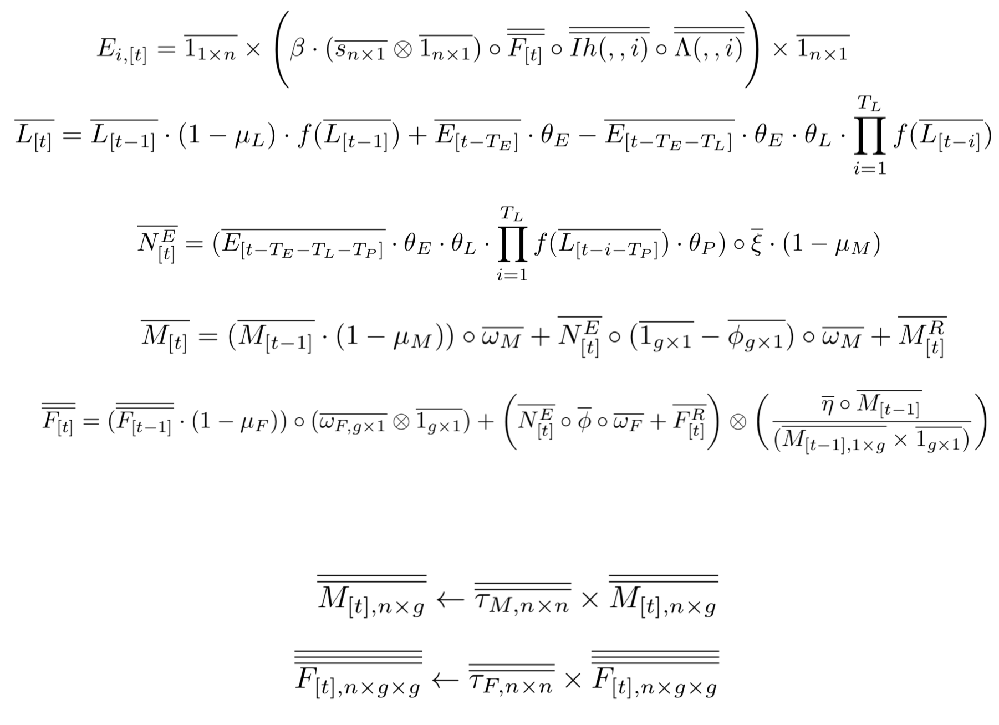<a href="https://www.youtube.com/watch?v=PPvzeV_Gylk&index=9&list=PLRzY6w7pvIWqFJi94ZfhPkSVnazlUylpN&t=0s">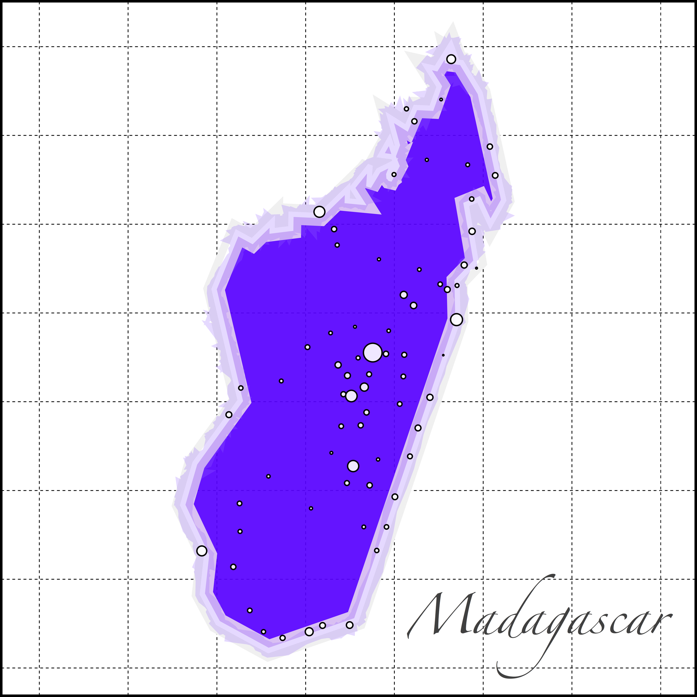</a>

<hr>

## Telling a Story

Data visualization is, ultimately, a tool to aid our narratives. Wether it is a scientific paper, a lecture, a talk, or an internal report; there is always an audience we want to convince, and a story we want to tell.

<br>
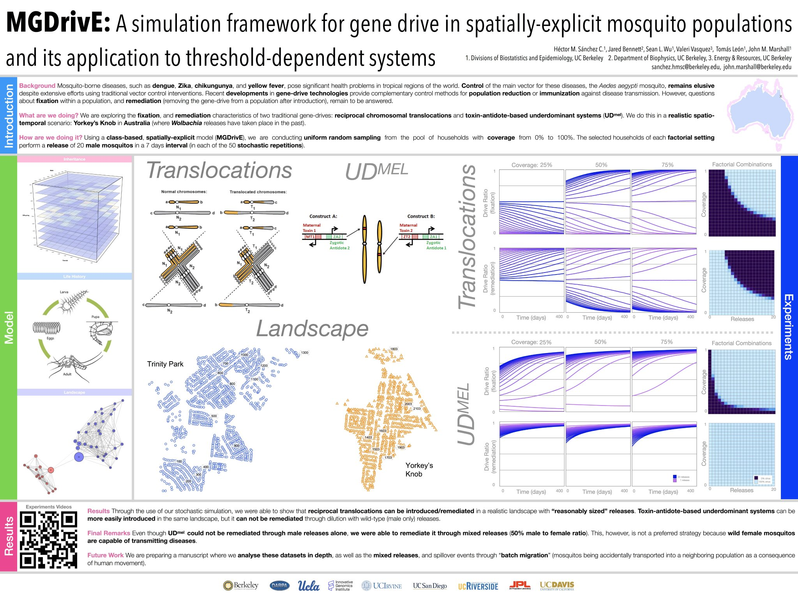

<hr>


## How?

There are several visual cues that help viewers interpret plots. The most common ones are:

* __Position:__ The coordinates of points are usually related to the independent variables shown in the plots axes.
* __Length:__ One of the easiest cues to decode, length is usually interpreted as _magnitude_.
* __Direction:__ When used in time series, it relates to increases/decreases of quantities.
* __Angle:__ Generally mapped to rate of change in vector representations.
* __Shape:__ Can be effectively used to differentiate between categorical datasets, or to emphasize data points.
* __Area:__ Used to encode magnitde, this variable can be an effective, albeit tricky, method to show an extra dimension of our data in a two-dimensional setting.
* __Volume:__ Although it is hard to use effectively, it can be used in analogous ways to area.
* __Color:__
  * __Hue:__ When used correctly in a [color palette](./colors.md), it can be a very effective way to transmit either magnitude, or difference between datasets.
  * __Saturation/Transparency:__ The density of the color can be mapped to the magnitude of the dependent variable.

<br>
<a href="https://www.amazon.com/Data-Points-Visualization-Means-Something/dp/111846219X/ref=sr_1_2?ie=UTF8&qid=1542581424&sr=8-2&keywords=nathan+yau">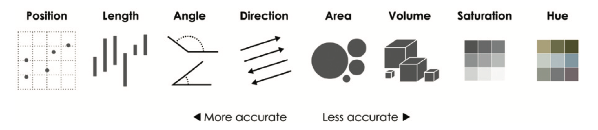</a>
<br>

<hr>

## Constraints

There's always tradeoffs we have to take into account when generating graphics for scientific/engineering contexts, and depending on our application we should be able to weight which elements are more important for our specific purposes.

### Time

Obvious to anyone who has ever worked with a deadline. The more time we spend working on a graphic, the better it will look. However, not always do we have the luxury to spend a week making one plot as aesthetically pleasing as possible. This is why practicing data visualization is generally a good idea. Through failure and experimenting, we iteratively find better ways to be time-efficient.


<br>

###  Utility VS Attractiveness

Increasing the level of abstraction usually tends to improve the aesthetics of visualization. This can be achieved by removing labels, and elements that might interfere with the graphics, but it comes at the cost of information.


###  Exploration VS Communication

Whilst it is often a good practice to make our visualizations as clean, and  "publication-ready" as possible, preparing a good graphic is time consuming. If we are interested in exploration, we might not need to devote so much time into labeling axes correctly, or using the appropriate font-size unless it is making the exploration easier.

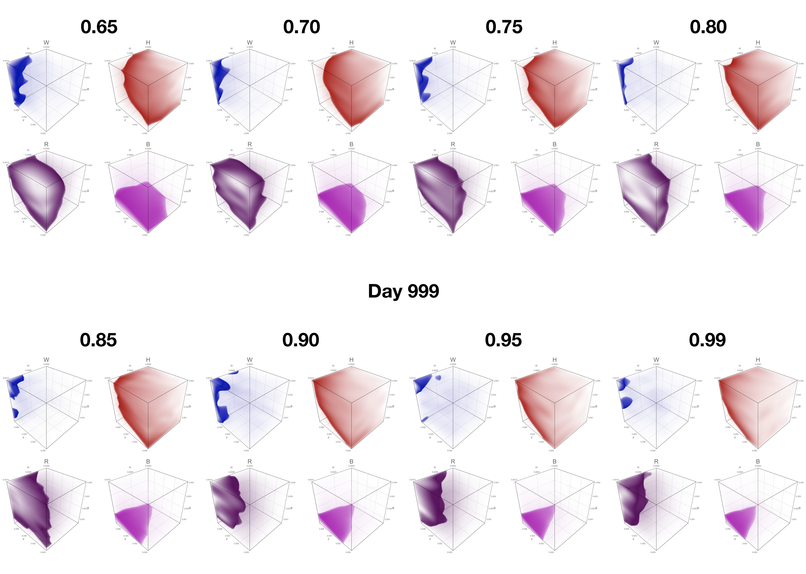

### Exploration VS Analysis

This constraint is a bit less obvious than the exploration versus communication one, but it's still important to make the distinction between plots made for the purpose of detecting large trends in a dataset (in an inital state of experimentation), and plots that are specifically designed for analysis of a clear phenomenon.

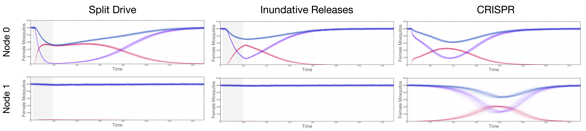

###  Static VS Dynamic

Dynamic contents have the advantage of being manipulable and interactive, which often results in better exploratory understanding of a concept. This, however, comes at the cost of media compatibility, and sometimes in a reduction of graphics quality.

<a href="https://chipdelmal.github.io/dataViz_CADi/globeFlights.html">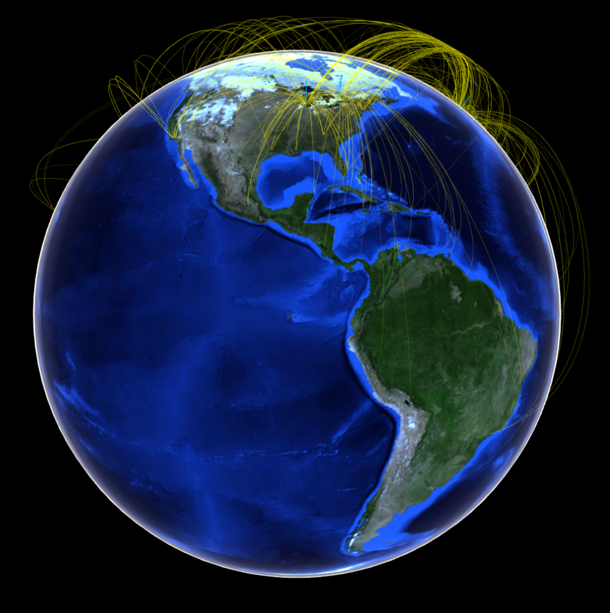</a>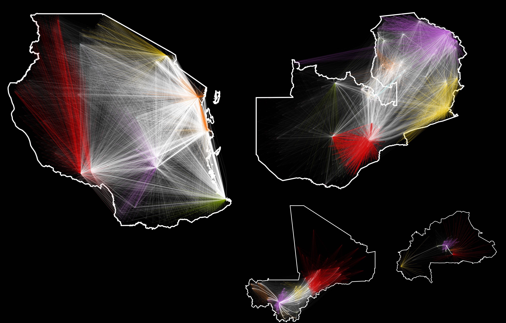


###  Print VS Digital

Although it is less often though about, there are still some constraints in the print media that are worth considering. There is still a sector of the population that prefers to read papers in a printed format, so the font-sizes, colors, and shapes should ideally be readable even in lower resolutions.

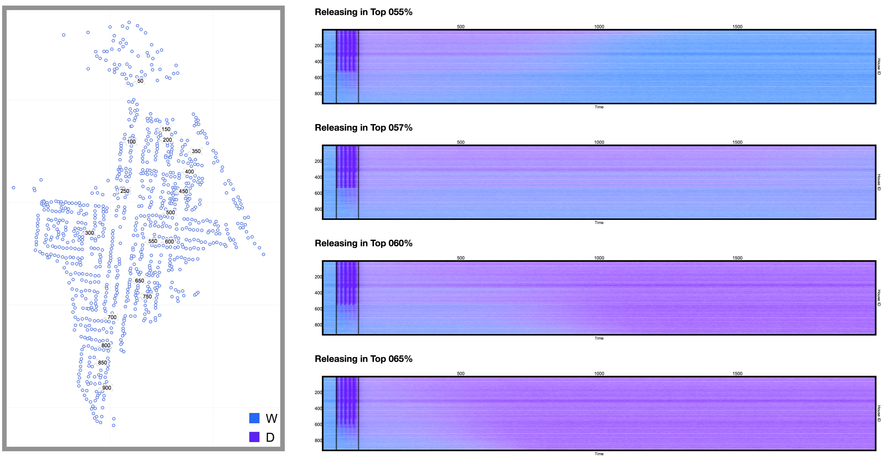

### File Size VS Quality

This will become more apparent when we look into image formats, but the amount of information we put into our graphics is related to their filesize (this is particularly important in raster-based filetypes). As such, we have to take into account publishers and computational limitations for the rendering of our graphics.


<hr>

## Steps

To go through an example of the usual steps taken to generate an effective visualization, we will follow an example inspired by the this [post](https://deadspin.com/chart-the-height-and-weight-of-every-nfl-player-by-po-1445608274), in which the NFL players' height and weight are plotted to make a comparison of their sizes across positions.

Note: _The code to do these plots is available in this [exercise](https://github.com/Chipdelmal/dataViz_CADi/tree/master/scripts/ScatterPlot)._

### 1) Explore the data

The [NFL Players Dataset](https://www.kaggle.com/kendallgillies/nflstatistics) can be downloaded in CSV format. After a quick inspection we can see that it does contain the information we need to create the visualization.

```
Age,Birth Place,Birthday,College,Current Status,Current Team,Experience,Height (inches),High School,High School Location,Name,Number,Player Id,Position,Weight (lbs),Years Played
,"Grand Rapids , MI",5/23/1921,Notre Dame,Retired,,3 Seasons,71,,,"Evans, Fred",,fredevans/2513736,,185,1946 - 1948
,"Dayton , OH",12/21/1930,Dayton,Retired,,1 Season,70,,,"Raiff, Jim",,jimraiff/2523700,,235,1954 - 1954
56,"Temple , TX",9/11/1960,Louisiana Tech,Retired,,1 Season,74,,,"Fowler, Bobby",,bobbyfowler/2514295,,230,1985 - 1985
30,"New Orleans , LA",9/30/1986,LSU,Retired,,5 Seasons,73,,,"Johnson, Quinn",,quinnjohnson/79593,,255,2009 - 2013
```

We must take into account, though, that  some of the player's positions are missing (denoted by an empty space in their position field).

```Mathematica
SetDirectory[NotebookDirectory[]];
rawData = Import["NFL.csv"];
{header, data} = {rawData[[1]], rawData[[2 ;; All]]};
positionsID = ((data[[All, position]] // DeleteDuplicates) // Sort)

out={"","C","CB","DB","DE","DL","DT","FB","FS","G","ILB","K","LB","LS","MLB","NT","OG","OL","OLB","OT","P","QB","RB",
"SAF","SS","T","TE","WR"}
```

### 2) Draft some ideas

After doing so, we can generate an initial draft of our plot.

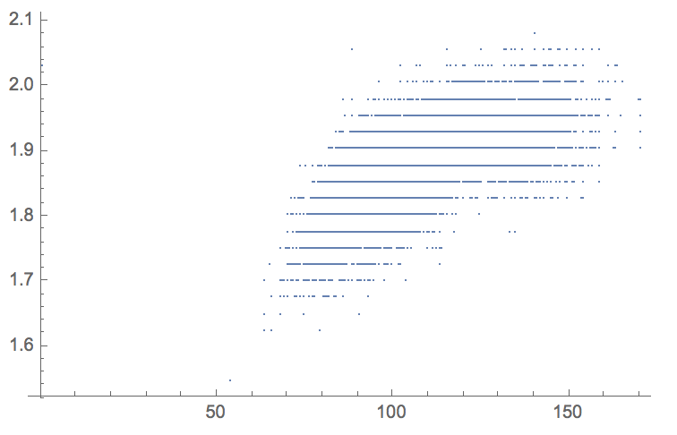

### 3) Select plot type

Even though it's not the prettiest representation of our data, this scatter plot might be a useful way to present the results if we work on it.

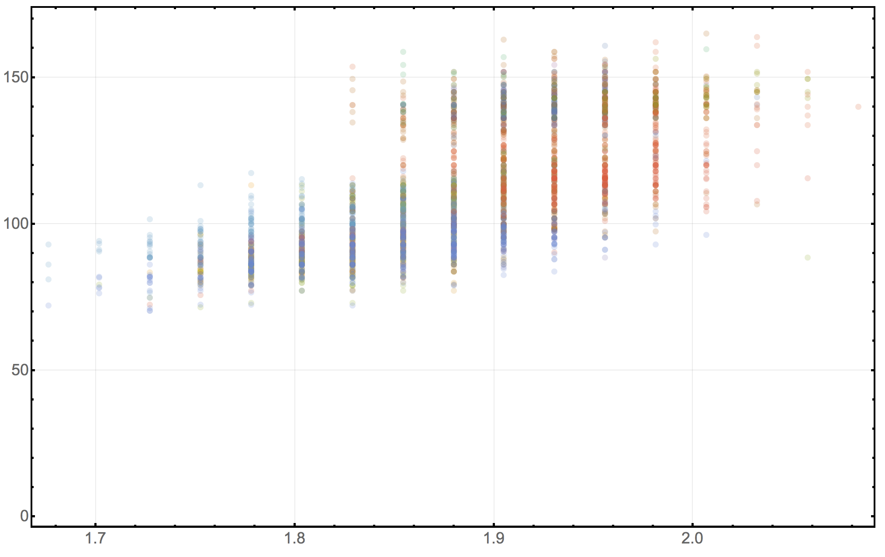

### 4) Generate initial draft

In this case, highlighting the position of some players might make it easier to read due to the high level of overlapping between clusters.

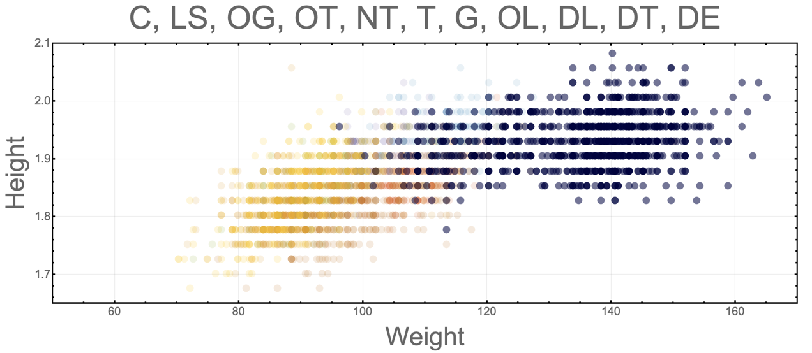

### 5) Improve aesthetics and communicability

We can improve the aesthetics a bit by changing the color palette, and increasing the dot size.

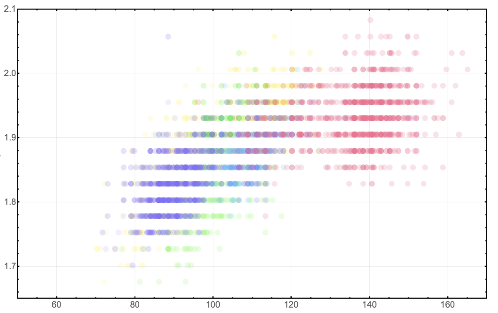

### 6) Iterate as necessary

After doing so, we add the color swatch, and iterate through previous steps if we need to.

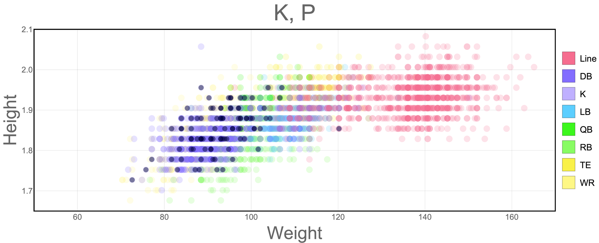

### 7) Work on the "presentation-ready" and "print-ready" versions

Finally, we can compile our plots and put them together in a way that favors readability of the data.

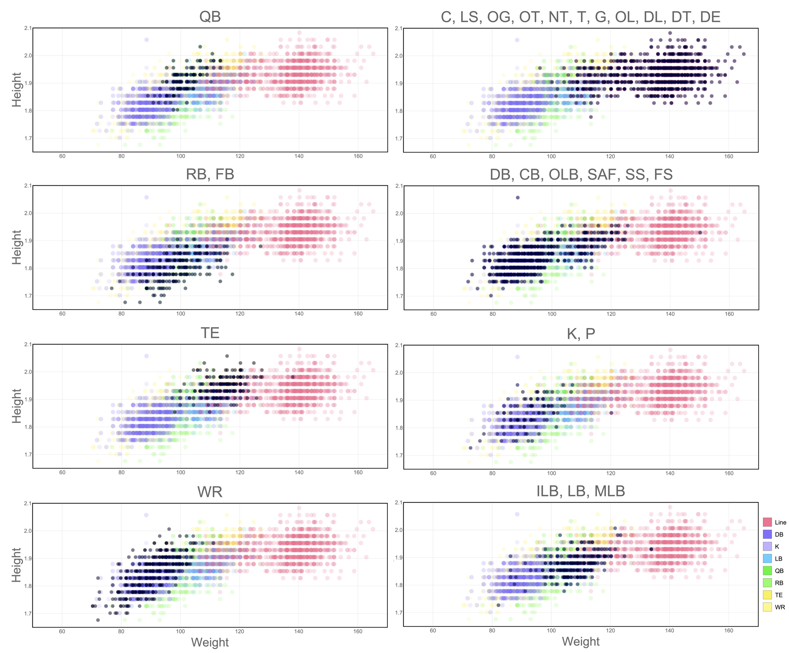

<!--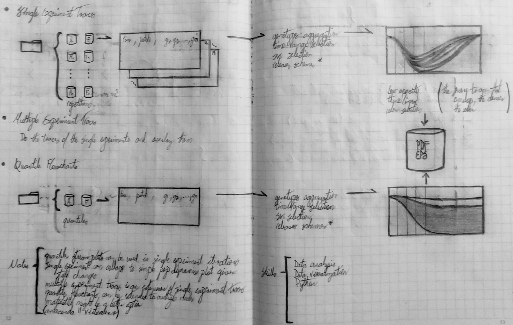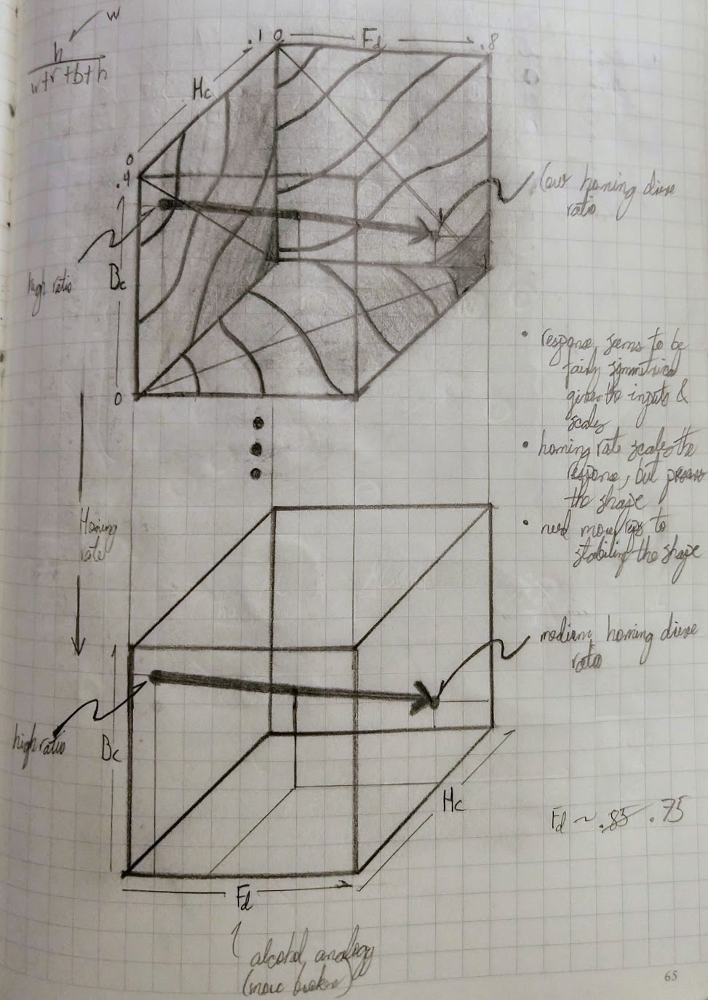-->

<hr><hr>

## Useful Resources

### Data Visualization Catalogue & Chartmaker Directory

<a href="https://datavizcatalogue.com/index.html">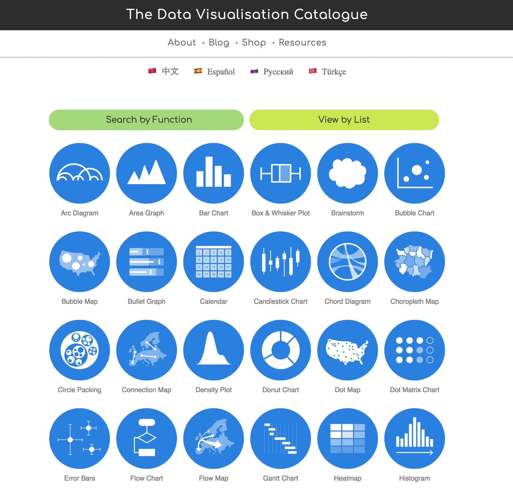</a><a href="http://chartmaker.visualisingdata.com/">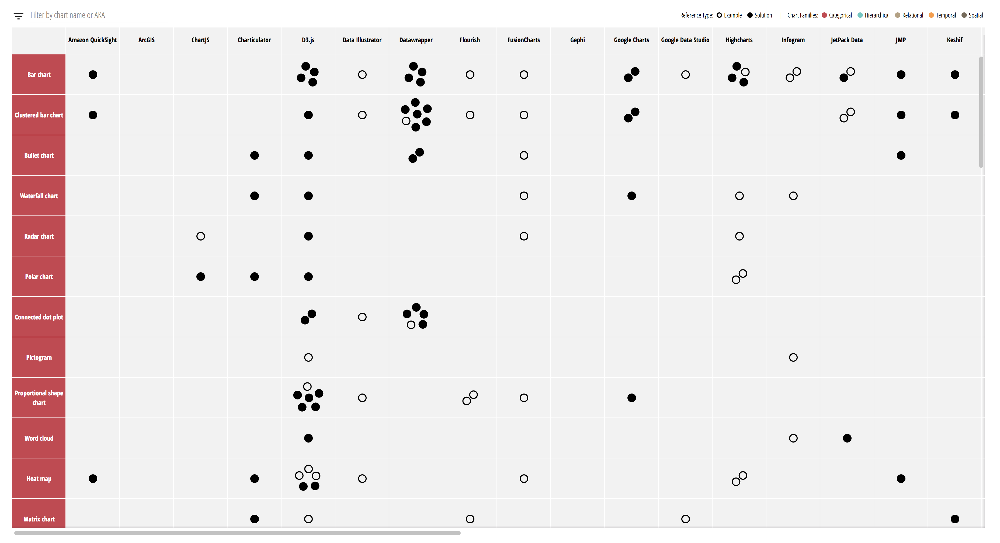</a>
