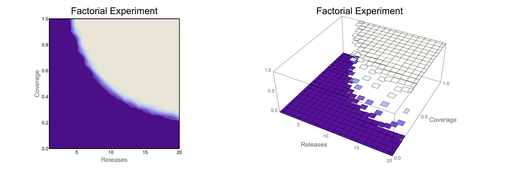

# Factorial Experiments

**Input:** *{x,y: z}* coordinates

## Density/Contour Plot

# Exercise

# <a name="exercise01">[1) Factorial Experiment Density Plot (Mathematica)](https://github.com/Chipdelmal/dataViz_CADi/tree/master/scripts/FactorialPlot)</a>

  

# Extensions and Gallery

## Genotypes ratios in a log-factorial search space

   
