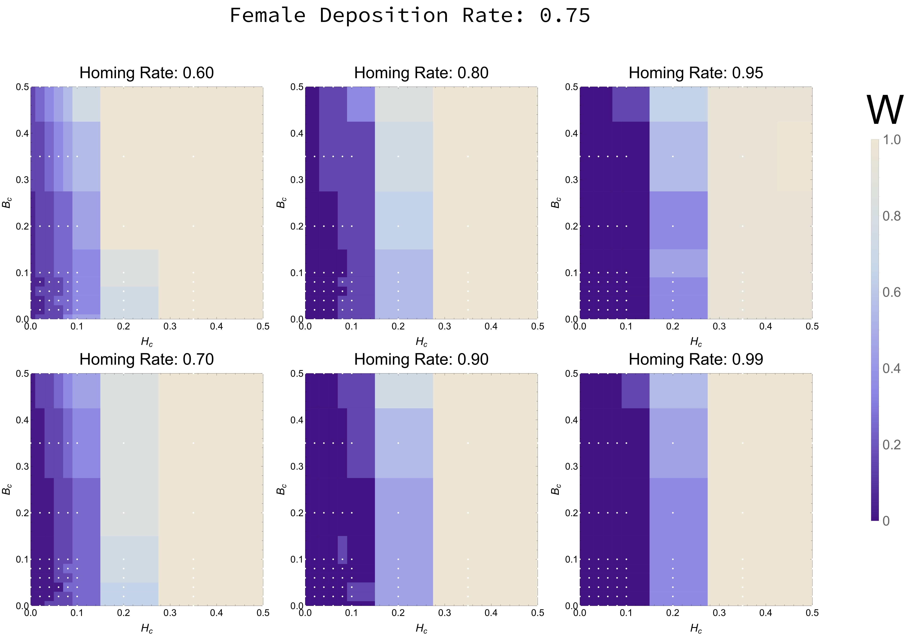
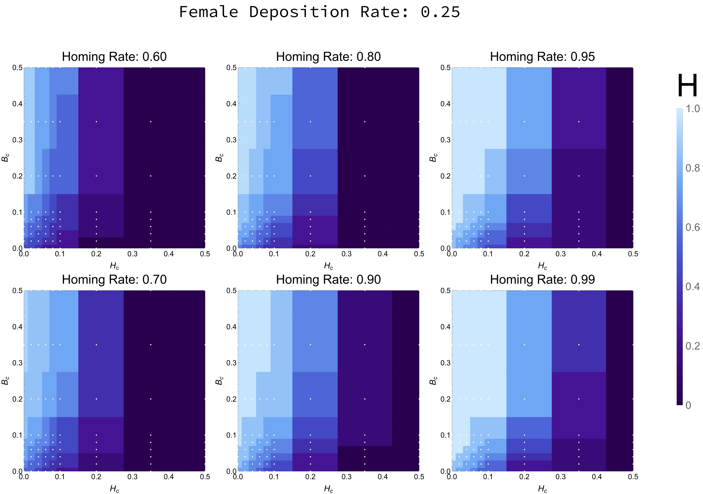

# Factorial Experiments

**Input:** *{x,y: z}* coordinates

In this case, we are strictly speaking of factorial data in the "two independent - one dependent" variable sense. There is a page dedicated to plotting [multi-dimensional](./multidimensional.md) data spaces. In this specific case, it is hard to top the representation of the data in density, contour plots or heatmaps.

## Density/Contour Plot (2D and 3D)

# Exercise

1. <a name="exercise01">[Factorial Experiment Density Plot (Mathematica)](https://github.com/Chipdelmal/dataViz_CADi/tree/master/scripts/FactorialPlot)</a>

# Gallery

## Genotypes ratios in a log-factorial search space

   
