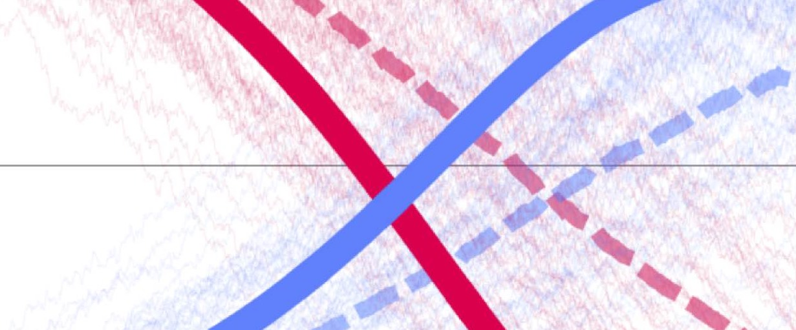
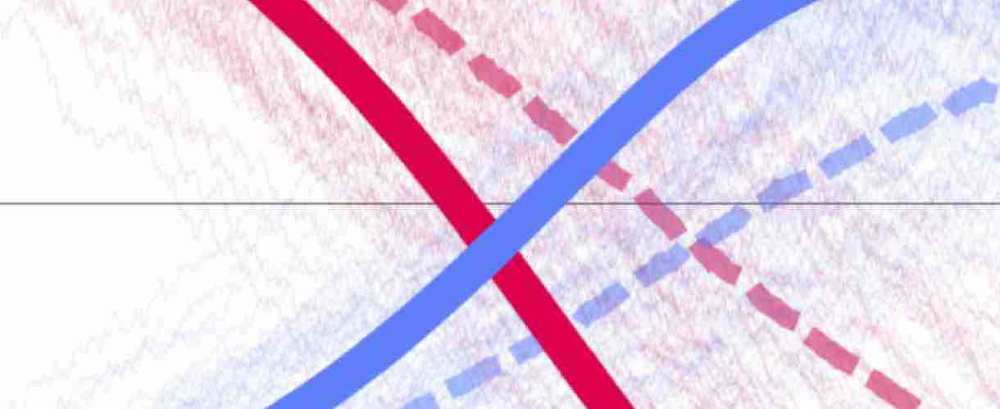
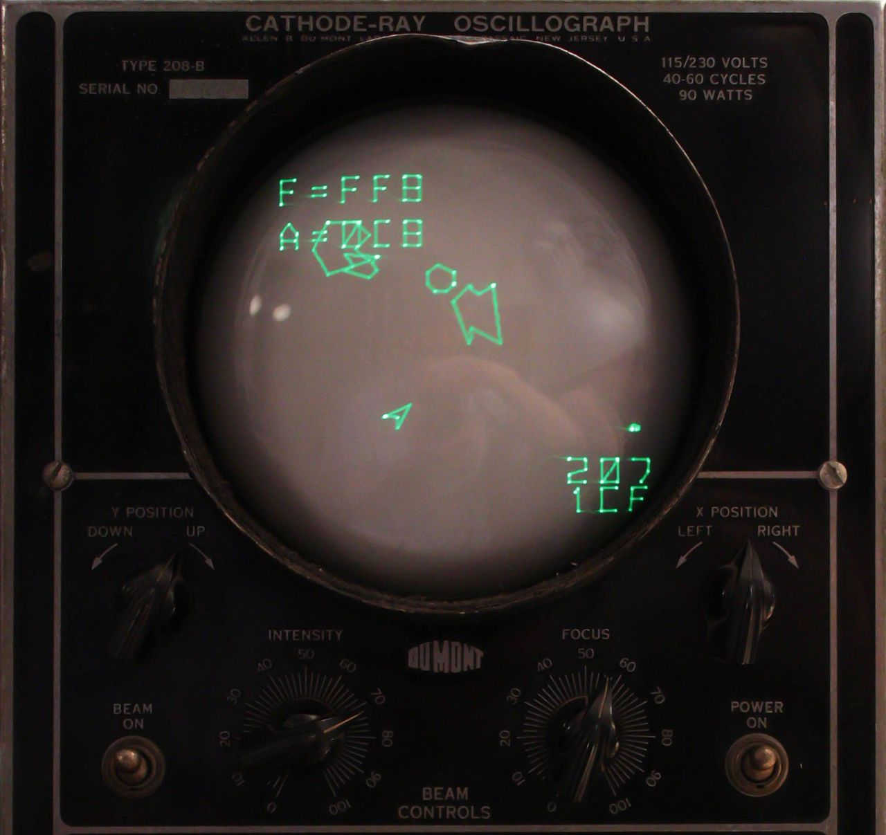
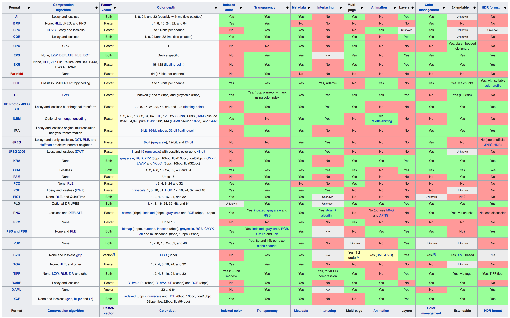

# Image Formats

## [Raster-based](https://en.wikipedia.org/wiki/Raster_graphics)

These formats represent images as arrangements of pixels. They are the most common way to store and transmit images due to their flexibility and versatility. Raster-based formats are well suited for photographs, but need more care in terms of scientific and engineering contexts because of their "pixel-based" nature.

Some of the most common raster-based formats are: _JPEG/JFIF, JPEG 2000, Exif, TIFF, GIF, BMP, PNG, PPM/PGM/PBM/PNM, WebP, HDR, HEIF, BAT, BPG_

  

###  [GIF](https://en.wikipedia.org/wiki/GIF)

This format is popular because of it's portability and low file size. It allows an 8bit palette per image (frame in animations), and uses the LZW losless compressing technique to reduce file-size (patented at the time). This format is well suited for sharp and low-colored images (such as logos), but not suited for images that need to display more than 256 colors at the same time (even for images/videos with lower than 256 colors this might not be a good option unless the color palette is optimized as described in this [link](http://blog.pkh.me/p/21-high-quality-gif-with-ffmpeg.html)).

### [JPG, JPEG](https://en.wikipedia.org/wiki/JPEG)

Uses the lossy [discrete cosine transform](https://www.youtube.com/watch?v=Q2aEzeMDHMA) to achieve high compression rates. This format is good for digital photographs  as it generally allows compression rates of about 10:1 without any obvious quality loss. In terms of scientific visualizations, however, [JPEG](https://en.wikipedia.org/wiki/JPEG) is often a bad alternative due to the artifacts generated by the compression (specially in high contrast region of the image).

   
  
  
  
   

###  [PNG](https://en.wikipedia.org/wiki/Portable_Network_Graphics)

Portable network graphics was created as a replacement for GIF images without a patent. This format allows only RGB spaces and is designed for easy transferring of lossless non-professional images on the internet. It uses a two stage compression method (filtering and compression).

###  [TIFF](https://en.wikipedia.org/wiki/TIFF)

Tagged Image File Format can be used as a container for [JPEG](https://en.wikipedia.org/wiki/JPEG)s or lossless raster information along with vector data about boundaries, and croppings. This format was created to provide a common ground for scanners in mid 80's but has been extended and is popular in photography, and publishing industry.

One of the advantages of [TIFF](https://en.wikipedia.org/wiki/TIFF) over [JPEG](https://en.wikipedia.org/wiki/JPEG) is that it allows lossless compression algorithms such as: [PackBits](https://en.wikipedia.org/wiki/PackBits), [LZW](https://en.wikipedia.org/wiki/Lempel%E2%80%93Ziv%E2%80%93Welch), [ZIP](https://en.wikipedia.org/wiki/Zip_(file_format)), amongst others.

## [Vector-based](https://en.wikipedia.org/wiki/Vector_graphics)

Vector graphics are based on 2d points that define the path along which lines are drawn (polygons or curves). Although less popular, these type of graphics provide much better sharpness in high contrast regions. Therefore, they are much better suited for the transferring of scientific and engineering graphics.

The most common vector-based formats are: _CGM, Gerber format, SVG_

  

### SVG

[XML-based](./dataHandlingAndDataSources.md) 2d vector image format. This file type is supported by all major browsers for the online exchange of graphics.

## [Compound](https://en.wikipedia.org/wiki/Image_file_formats#Compound_formats)

Common compound formats are: _EPS, PDF, PS, PICT, WMF/EMF, SWF, XAML_

###  EPS

###  PDF

###  PS

## [Screen Resolutions and Aspect Ratios](https://en.wikipedia.org/wiki/Display_resolution)

  

## More information

For a more thorough comparison of various images formats look at this [link](https://en.wikipedia.org/wiki/Comparison_of_graphics_file_formats).

<!--

## Video Formats

### [MPEG](https://en.wikipedia.org/wiki/Moving_Picture_Experts_Group)

### [MP4](https://en.wikipedia.org/wiki/MPEG-4_Part_14)

### [MOV](https://en.wikipedia.org/wiki/QuickTime_File_Format)

### [MKV](https://en.wikipedia.org/wiki/Matroska)

Matroska video is a container format.
VLC player. -->
