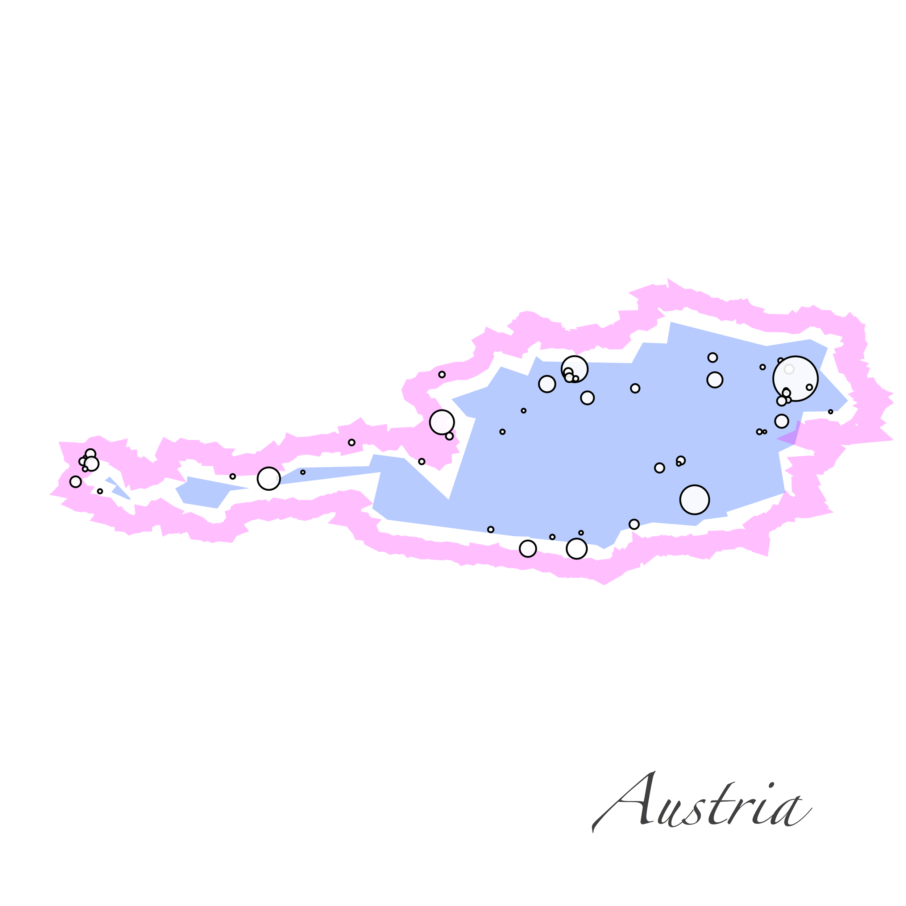
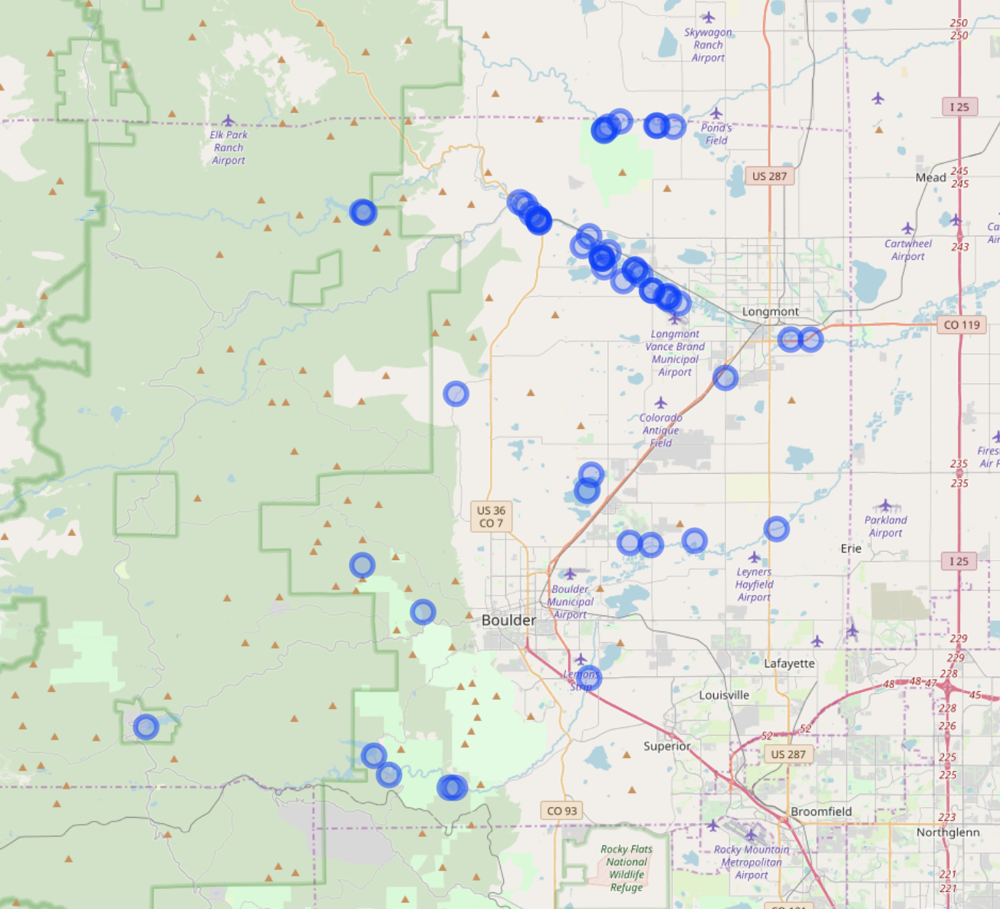
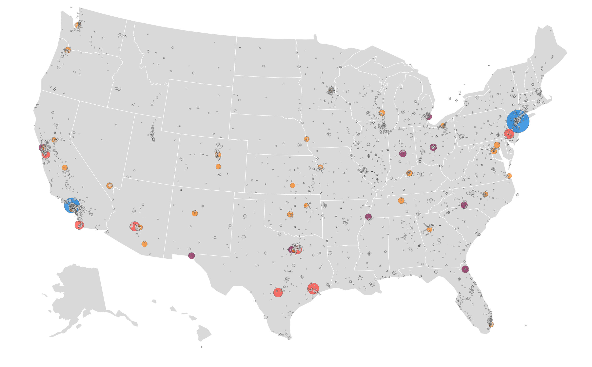
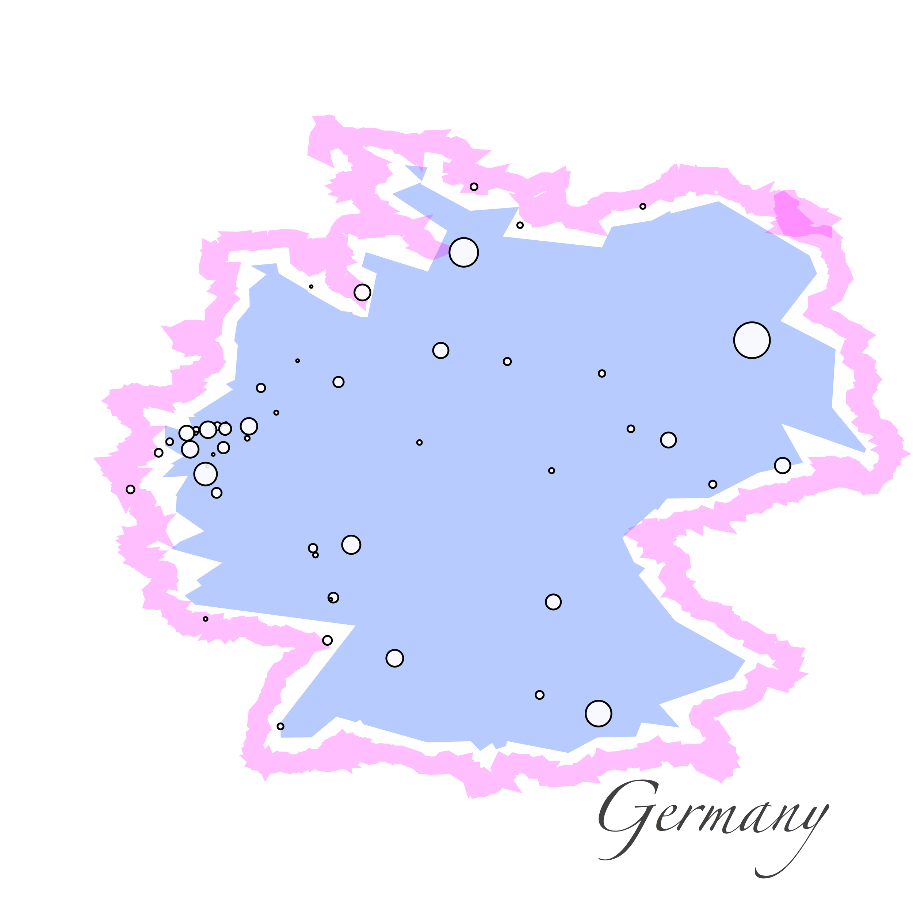

# Geographic

## Map

 

## Globe

 

# Exercises

##  <a name="exercise01">[1) Leaflet (R)](https://github.com/Chipdelmal/dataViz_CADi/tree/master/scripts/Map)</a>

 

##  <a name="exercise01">[2) Folium (Python)](https://github.com/Chipdelmal/dataViz_CADi/tree/master/scripts/Map)</a>

 

##  <a name="exercise01">[3) Globe plotting (R)](https://github.com/Chipdelmal/dataViz_CADi/tree/master/scripts/Globe)</a>

 

##  <a name="exercise01">[5) Bubble Map (Python)](https://github.com/Chipdelmal/dataViz_CADi/tree/master/scripts/Globe)</a>

 

##  <a name="exercise01">[6) Fancy Map (Mathematica)](https://github.com/Chipdelmal/dataViz_CADi/tree/master/scripts/Globe)</a>

 
