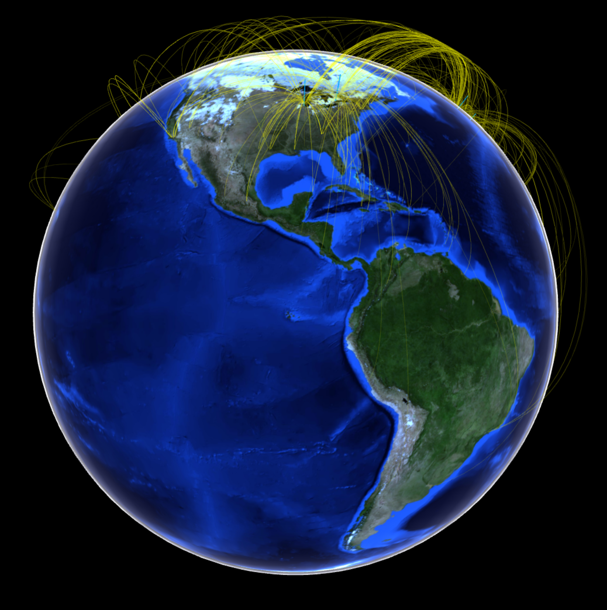

# Geographic

**Input:** _GeoData (points, polygons)_

Geographic data is usually one of the most difficult to work with. This is because it requires high precision, and involves taking into account information such as political boundaries and reference systems. For that reason, it is highly suggested to try to gather data in a consistent framework and develop frameworks that are as streamlined as possible.

## Map

The most traditional way to show geographic information is on a 2D map. This usually easy enough for viewers to decode, given the appropriate cues.

 

## Globe

A more interactive way to show data without having to worry about projections.

 

## Composite

Variations such as: network, heatmap, or bubble chart; over a traditional map are often effective to add dimensions to the visualization.

 

# Exercises

##  <a name="exercise01">[1) Leaflet (R)](https://github.com/Chipdelmal/dataViz_CADi/tree/master/scripts/Map)</a>

 

##  <a name="exercise01">[2) Folium (Python)](https://github.com/Chipdelmal/dataViz_CADi/tree/master/scripts/Map)</a>

 

##  <a name="exercise01">[3) Globe plotting (R)](https://github.com/Chipdelmal/dataViz_CADi/tree/master/scripts/Globe)</a>

 

##  <a name="exercise01">[5) Bubble Map (Python)](https://github.com/Chipdelmal/dataViz_CADi/tree/master/scripts/Globe)</a>

 

##  <a name="exercise01">[6) Fancy Map (Mathematica)](https://github.com/Chipdelmal/dataViz_CADi/tree/master/scripts/Globe)</a>

 

# Gallery

