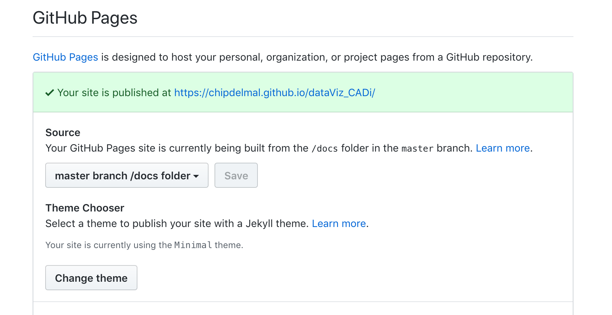
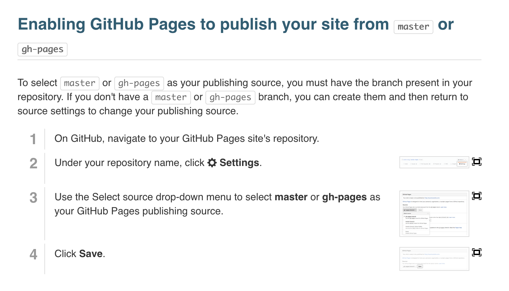

# Github pages

Most programming projects involve the use of a [version control]() resource, the most popular being [github](). It is extremely easi to create a blog-style website for any project created as a github repository, and there are a couple approaches to do it with their own merits and levels difficulty. The simplest one is to create a **docs** folder within our main branch and use a github template to convert the [markdown](./markdown) files to HTML. The most flexible one is to create a totally independent branch called **gh-pages**, which will contain our website files. In both cases our website will be accessible in a URL that follows this pattern: **http://_githubUsername_.github.io/_projectName_/** (for example, the website for this course is: [http://chipdelmal.github.io/dataViz_CADi/](chipdelmal.github.io/dataViz_CADi/)).

## Why should we use it?

Creating a website for our projects is good not only for exposure, but it can help showcase interactive contents and higher resolution formats. Most journals have strict limitations about the kind of media allowed to be submitted, so having an independent website can allow us to upload supplementary materials that make our findings more intuitive and attractive.

## Projects Websites

### 1. "Docs" folder approach

As mentioned before, the easiest way to create a website for our coding projects is to create a folder named **docs** within own main branch, and point the repository to parse the [markdown](./markdown) into a website. This can be done easily by going to the settings of the repository and selecting the appropriate option in the "GitHub Pages" section.

##### Github Templates

It is also worth noting that github also has pre-built templates to streamline the process to generate appealing websites.

## 2. "gh-pages" branch approach

A second, much more versatile option, is to create a totally independent branch of our repository called **gh-pages**. In this branch, we will create a website for the project. A good guide to follow can be found in this [link](https://help.github.com/articles/configuring-a-publishing-source-for-github-pages/).

##### Jekyll Templates

[Jekyll](https://jekyllrb.com/) offers a variety of ruby-based templates that we can use to make the creation of good-looking websites easier. A gallery of freely available templates can be accessed from this [link](http://jekyllthemes.org/). [Github](https://github.com/) incorporates the necessary mechanisms to do the translation of the jekyll templates into HTML so that it is displayed correctly without any further intermediate steps. It must be noted, however, that some experience with HTML, javascript, and CSS is desirable to be able to make modifications that are specific to scientific projects.

## Github Personal Website

We can also create our personal website with free hosting on the github servers. Although this is outside of the scope of the course, it is usually a good idea to have a site in which we can showcase some of our work. A guide on how to setup these websites can be read on this [link](https://pages.github.com/).

