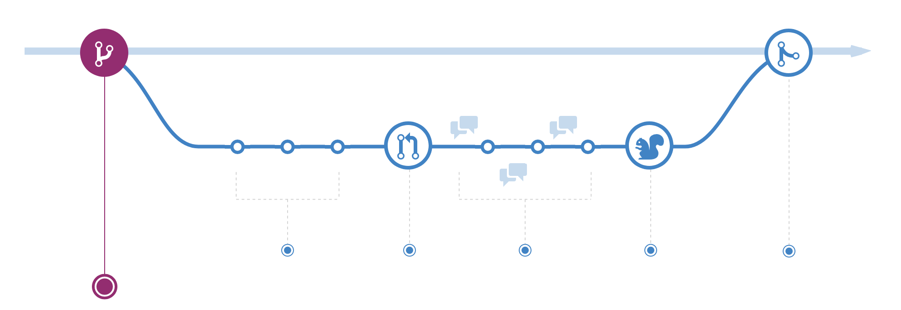

# GitHub

GitHub is the most popular web-based [version control](https://en.wikipedia.org/wiki/Version_control) service that uses the [Git](https://git-scm.com/) protocol. It is very popular for programming projects due to its ability to provide access control, bug tracking, wikis, feature requests, amongst many other features.

The main advantage of using version control, and github, is that it provides a permanent repository for our code and all the history of the changes we make to it.

Another advantage of GitHub is that it allows the seamless integration of [markdown documents](./markdown.md) within our repository, and the creation of websites for the projects with its [gh-pages](./ghPages.md).

For purposes of this course, it is highly recommended to download the [github desktop app](https://desktop.github.com/) for easier use (without the command line) and/or the [atom IDE](https://atom.io/).

