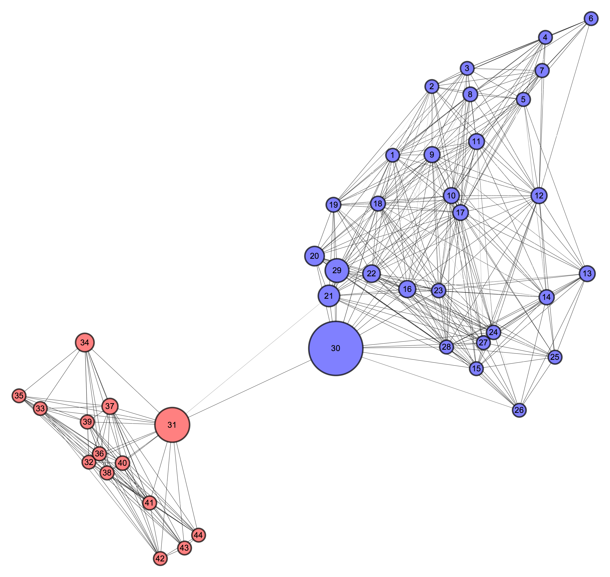
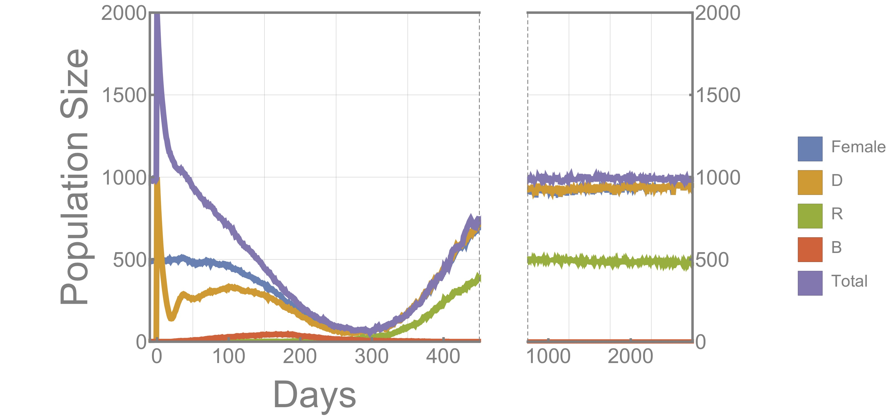
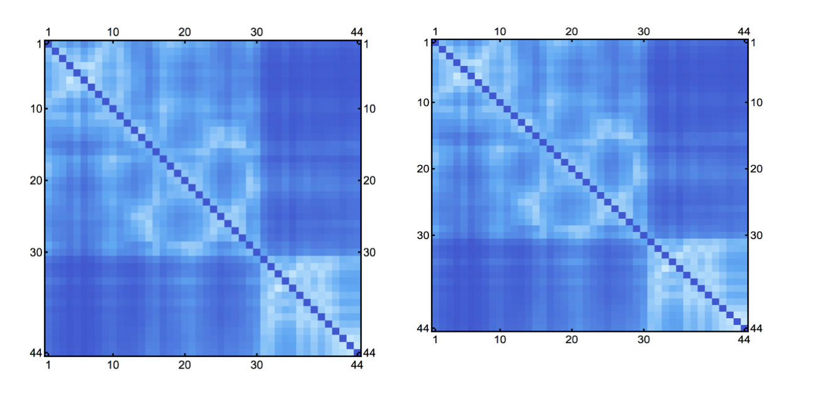
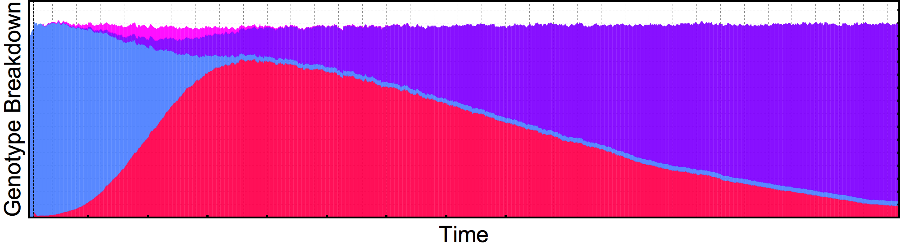
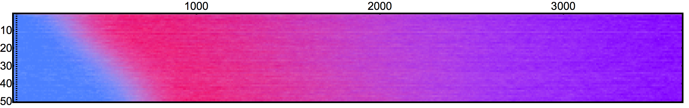

# Good Practices

As in any other discipline, data visualization has its own set of rules to follow in our attempts to transmit information. Some of these "good practices" follow.

#### Provide additional reference elements when possible

Adding grid lines, highlighting important regions, shading areas, are all ways we can help viewers understand the underlying concepts more easily.

#### Scale areas proportional to the variable

When mapping a variable to an area, make sure to scale the aforementioned variable to the area of the representation, not it's radius/side-length.

#### If possible, use length instead of area as a visual cue

Differences in lengths are more easily perceived by viewers than areas, so it's generally a good idea to give them priority when thinking of how to map variables in a plot.

#### Do not clip the axes ranges unless a reference is provided

There are situations in which clipping the ranges of the axes might be desirable or even necessary, but this can distort our interpretations of results due to the perceptual magnification of effects. As such, it is a good practice to avoid clipping axes, unless a "full-range" version is provided for fair comparison. Another alternative would be to use logarithmic scales.

 

#### Use the widest color scale possible

Although it is usually a matter of taste, it is generally a good idea to try to maximize the distance between color shades in our palettes, as we can't rely on audiences having a good projector/screen/eyesight to differenciate slight differences in shades.

####  Map variables to their most natural representation

It is worth taking time to think if we are using the data representation that most people associate with it. When we think of time, we usually expect it plotted in a linear *x-axis*, or as the passage of frames in animations. It is sometimes useful to try an innovative alternative, but always keeping in mind that the viewers might find it unnatural at a first glance.

#### Do not change the aspect ratio post-rendering

It is extremely easy for audiences to detect when an aspect ratio has been modified. This effect is particularly magnified when numbers/letters are present.

#### Explore alternatives

Sometimes it is worth spending some time attempting some "out of the box" representations of the data. This is not only create interest, but to verify that the way we are presenting our information is the most efficient one.

#### Be flexible in learning tools

Most "easy-to-use" frameworks are designed to be good in generating certain types of graphics. Unless we are willing to learn a more general (but more complex) framework such as [D3.js](), it is highly likely that we will have to use different frameworks for different tasks. For this reason, it is worth learning a variety of toolkits so that we can be quick in our delivery of results.

#### Practice, practice, practice

The only way to develop a "sense" of what data representations fit certain plot types, and which style modeifications are more appealing is to practice often.

