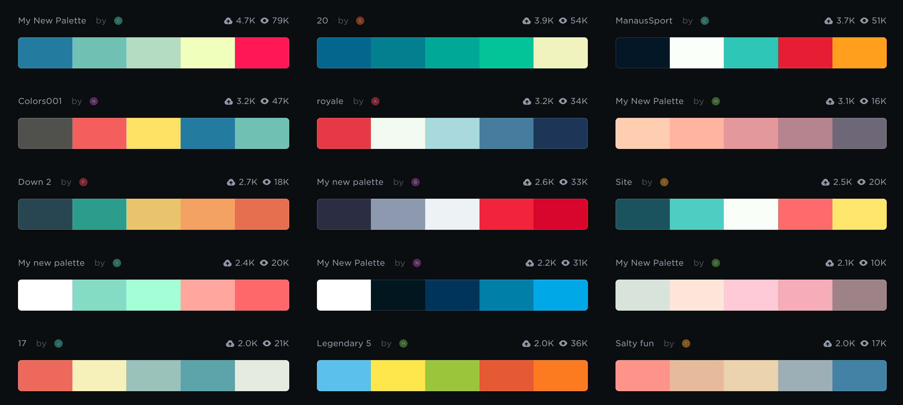

# Good Practices

As in any other discipline, data visualization has its own set of rules to follow in our attempts to transmit information. Some of these "good practices" follow.

#### Provide additional reference elements when possible

#### Scale areas proportional to the variable

#### If possible, use length instead of area as a visual cue

#### Do not clip the axes ranges unless a reference is provided

#### Use the widest color scale possible

####  Map variables to their most natural representation

#### Explore alternatives

#### Be flexible in learning tools

