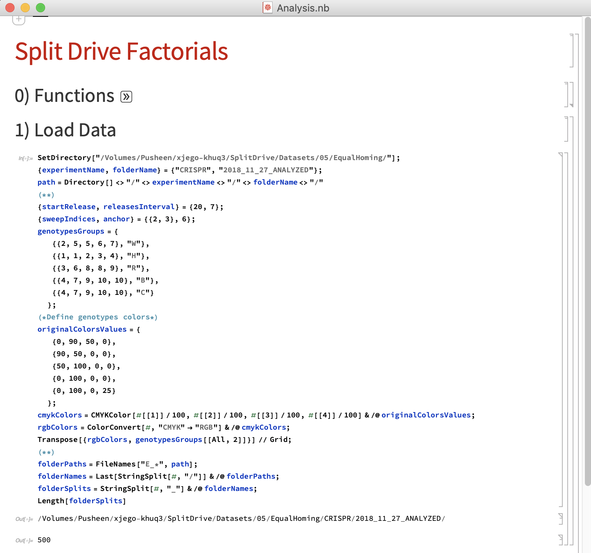
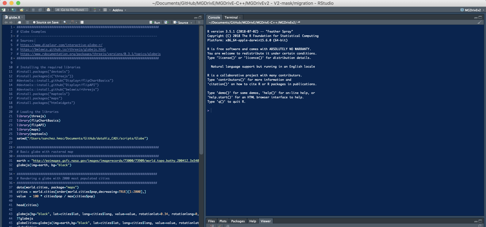
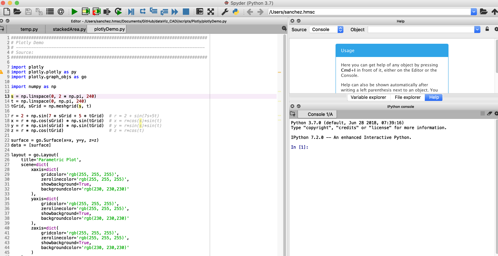
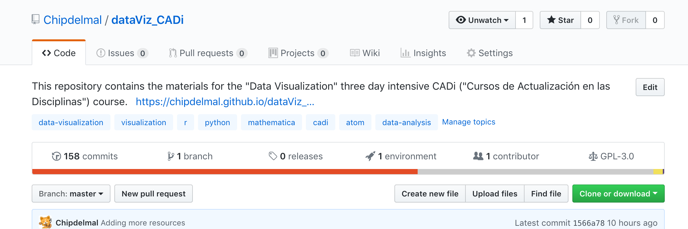
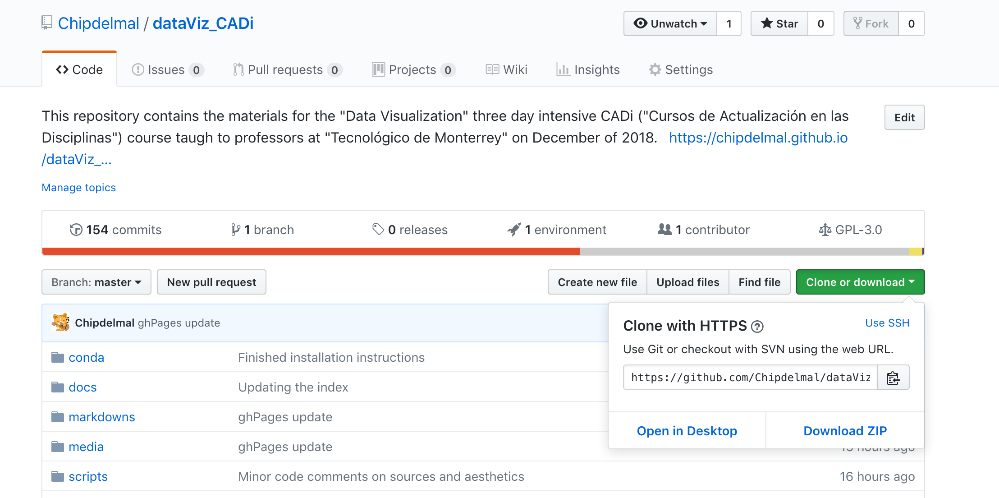

# Data Visualization

This course is designed as a 3 day intensive rundown of data visualization principles, techniques, common frameworks, and how to put together some of the material developed throughout the course in a [gh-pages website](./ghPages.md)/[html-based](./revealjs.md) presentation using [markdown](./markdown.md).

## Introduction

Throughout these 3 days, we will look at a number of exercises. Most of these demonstrations were developed in [R](https://www.r-project.org/) due to its flexibility and community support, although some were coded in [Python](https://www.python.org/) and [Mathematica](http://www.wolfram.com/mathematica/) to allow the comparison of different approaches to data visualization and frameworks. The full list of exercises along with the languages they were developed in is:

1. [Box Whisker (R)](../scripts/BoxWhiskerChart/)
1. [Bubble Chart (Python)](../scripts/BubbleChart/)
1. [Chord Diagram (R)](../scripts/Circlize/)
1. [Dygraph (R)](../scripts/Dygraph/)
1. [Factorial (Mathematica)](../scripts/Factorial/)
1. [FFmpeg (Bash)](../scripts/FFmpeg/)
1. [Globe (R)](../scripts/Globe/)
1. [Maps (R/Python)](../scripts/Maps/)
1. [Network (R)](../scripts/Network/)
1. [Parallel Plot (Python)](../scripts/ParallelPlot/)
1. [Random Networks (Mathematica)](../scripts/NetworksRandom/)
1. [Remark (Markdown/HTML)](../script/Remark/)
1. [Revealjs (HTML)](../scripts/revealjs/)
1. [Scatter Plot with Histograms (Python)](../scripts/Python/)
1. [Scatter Plot (Mathematica)](../scripts/ScatterPlot/)
1. [Stacked Area Plot (R/Python)](../scripts/StackedArea/)
1. [Streamgraph (R)](../scripts/Streamgraph/)
1. [Transitions (Mathematica)](../scripts/Transitions/)
1. [Time Series (R/Mathematica)](../scripts/TimeSeries/)
1. [Tree Map (R)](../scripts/TreeMap/)
1. [Violin Plots (R)](../scripts/ViolinPlots/)
1. [Word Cloud (R)](../scripts/WordCloud/)

Some of the examples were developed from scratch, whilst some others were coded as variations of online sources (in which case the sources are cited within the code snippets). The used datasets are either public domain or datasets developed as part of my research group that we are allowed to share.

### Objectives

* To show some [good practices](./goodPractices.md) in data visualization
* To showcase some of the newer frameworks used to generate scientific and engineering plots
* To teach examples of how to choose the correct [plot type](./plotTypes.md) according to our data, and message we want to transmit
* To teach which graphics formats are the best for engineering/scientific purposes
* To show how our visualizations can be embedded into presentations and shown online using markdown and HTML
* To get some exposure on alternatives to make data visualization more attractive/innovative

## My background

Click on the GIF to take a look at my [personal website](https://chipdelmal.github.io/)!

##  Course Structure and Setting up the Required Software

This course was designed to try to accommodate the widest set of audiences in engineering and scientific disciplines. As such, it provides guidelines that are common to most disciplines. For this reason, it was developed to make use of the three aforementioned programming platforms ([R](https://www.r-project.org/), [Mathematica](http://www.wolfram.com/mathematica/) and [Python](https://www.python.org/)) although no deep knowledge of the platforms is required.

### Setting up Mathematica

Installing Mathematica is as simple as following the instructions on the wizard after [downloading it from the institute's server](../media/mathematicaDownload.pdf).

### Setting up R and RStudio

Install R by downloading its [executable packages](https://www.r-project.org/), and do the same for [RStudio](https://www.rstudio.com/).

### Setting up Python, Anaconda and the Required Libraries

The most complicated of the three tools is Python with it's required libraries. However, this can be done easily by installing [anaconda](https://conda.io/docs/user-guide/install/index.html), and then following the instructions detailed in the [python introduction](./pythonAndAnaconda.md) (easy) and/or the [dataViz conda environment readme](../conda/README.md) (advanced).

### Forking the Repository

Install the [github desktop app](https://desktop.github.com/). Click on the fork button in the repository's [main page](https://github.com/Chipdelmal/dataViz_CADi):

Once forked, click on the clone or download button, followed by open in desktop:

