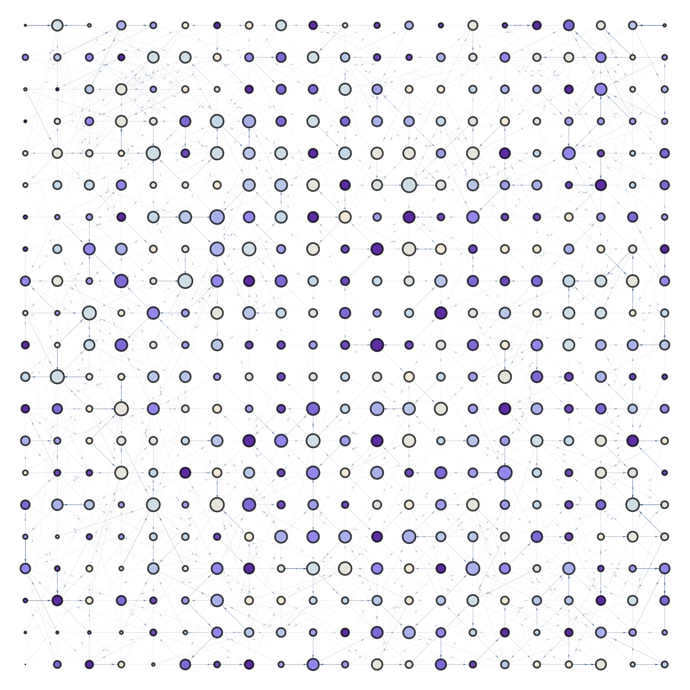

# Data Visualization

This course is designed as a 3 day intensive rundown of data visualization principles, techniques, common frameworks, and how to put together some of the material developed throughout the course in a [gh-pages website](./ghPages.md)/[html-based](./revealjs.md) presentation using [markdown](./markdown.md).

## Introduction

Exercises/Demonstrations:

1. [Box Whisker (R)](../scripts/BoxWhiskerChart/)
2.
3.
4.
5.
6.

### Objectives

* To show some [good practices](./goodPractices.md) in data visualization
* To showcase some of the newer frameworks used to generate scientific and engineering plots
* To teach examples of how to choose the correct [plot type](./plotTypes.md) according to our data, and message we want to transmit
* To teach which graphics formats are the best for engineering/scientific purposes
* To show how our visualizations can be embedded into presentations and shown online using markdown and HTML
* To get some exposure on alternatives to make data visualization more attractive/innovative

### Out of Scope

* Data acquisition (scraping)
* Data wrangling
* "Print-ready" images editors (photoshop, gimp)
* Dimensionality reduction techniques (PCA)
* Artistic data visualization
* Infographics
* Psychological iterpretations

## My background

