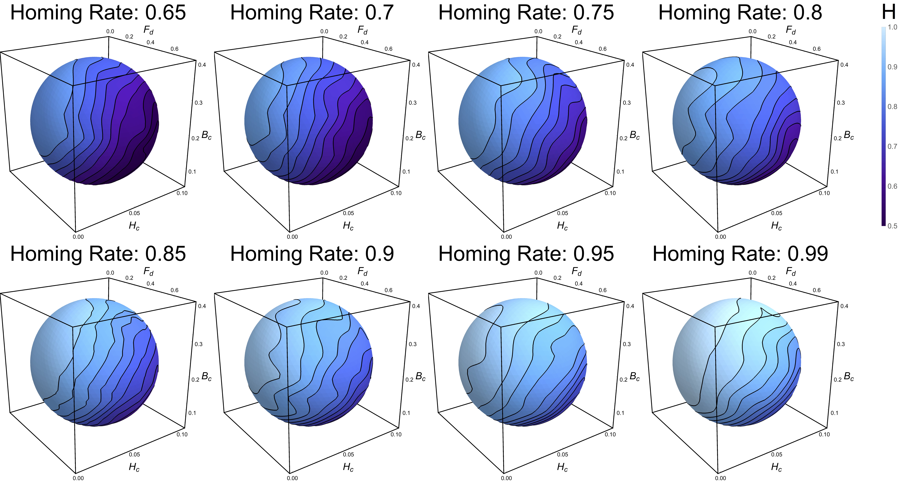
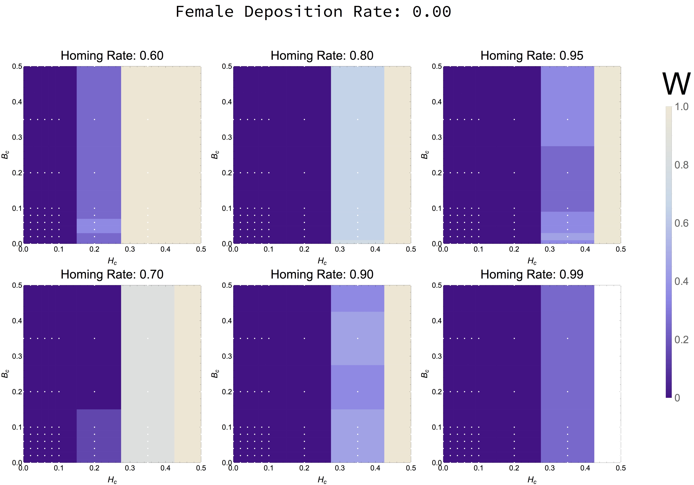
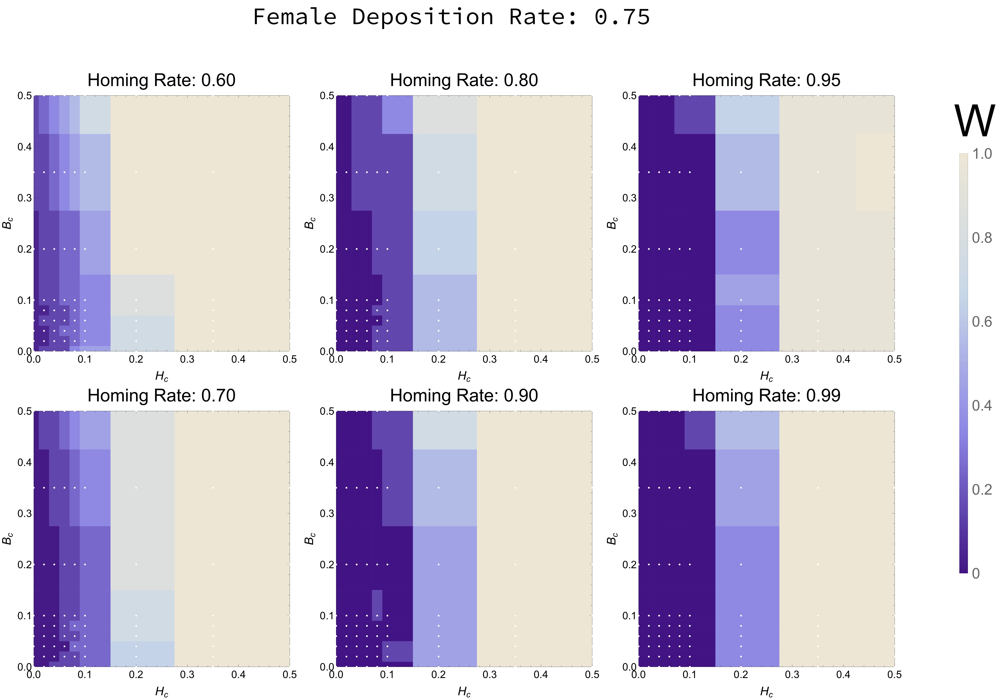
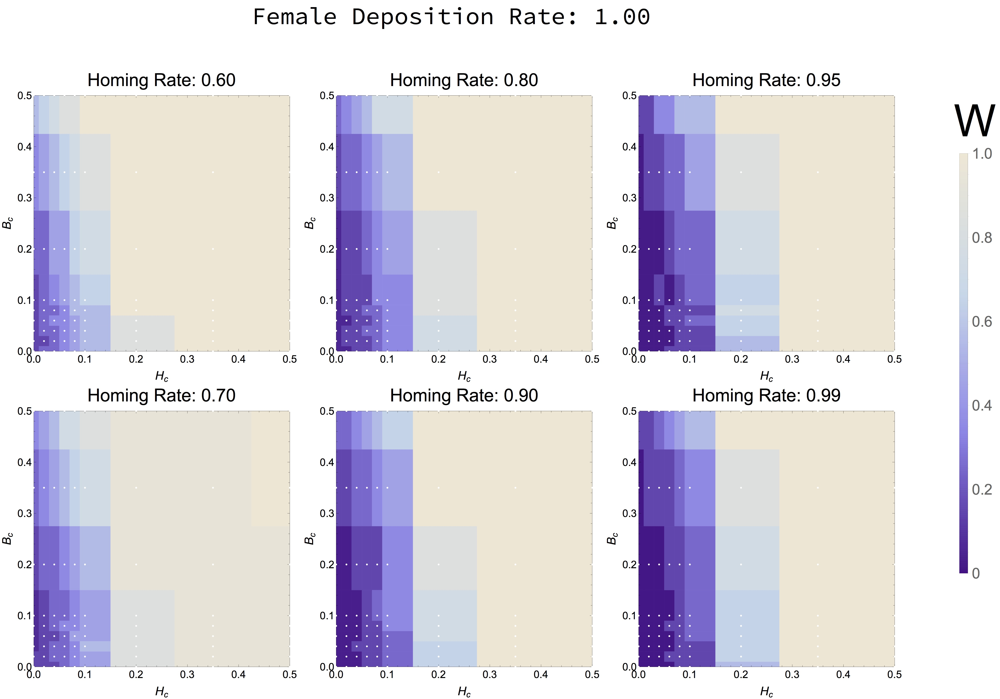
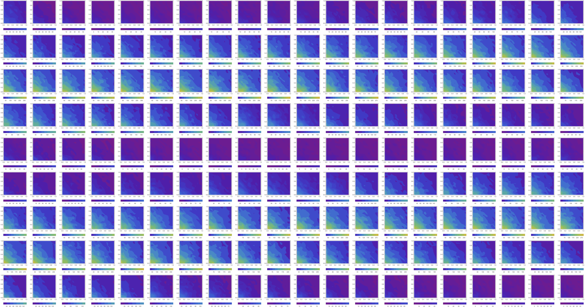

# Multidimensional

**Input:** *{multiple independent variables, multiple dependent variables}*

Effectively transmitting, and understanding multidimensional data is inherently difficult because it is difficult for us to make spatial analogies to it. Most of our understanding of data comes from translating it into a spatial realm in which we can make sense of it. Therefore, when we are faced with datasets that we can't easily map into a spatial context, it is difficult for us to make inferences about its nature. There are, however, some ways in which we can make some representations of these data, some of which we will cover in this module.

## Density/Contour (4D)

If the data consists of three independent variables and one dependent one, a 4D density/contour plot is a good alternative. In this representation, the data is shown as a surface (the type of surface can change), and the magnitude of the dependent variable is mapped to the color projected in the solid.

  

## Radial/Nightingale Rose

A radial plot is a good alternative whenever several attributes of an object of study. It provides a fair baseline for multiple characteristics to be assessed at a glance. Alternatively, different objects of study can be compared in one characteristic if the data is transposed. In addition to this, the clever use of colors can help include more information in the same graphic.

  

<!--## Nightingale Rose Chart-->

## Parallel Coordinates Plot

The "parallel coordinates" plot is an option for showing multiple attributes in which we want to detect correlations (positive or negative).

  

## Unfolding Dimensionality

Finally, there is always the option to "unfold" the dimensionality of the data by mapping it into lower-dimension spaces. This provides a good compromise when the data displays "simple" relations between variables.

  

# Extensions and Gallery

#### Changes in mosquito quantities over time, given the coverage of two control interventions

