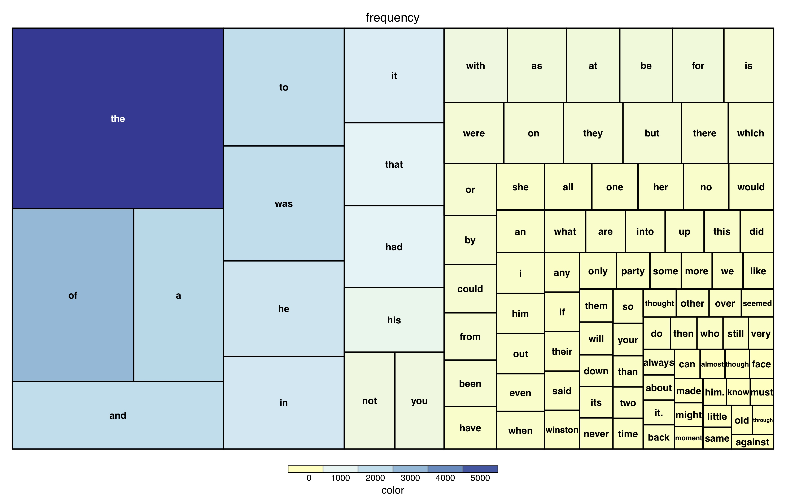

# Plot Types by Function

Plots types are as difficult to classify as the data they represent. There are cases in which the selection of a visualization is clear cut, but more often than not, the selection of the appropriate way to express our data depends on the context we want it to appear in. This can be as wide as the media we are gonna use it for (live demo, print, etcetera), or the field we work in (network theorists prefer graph visualizations, whilst genetic analysts prefer heatmaps). For these reasons, it is difficult to classify the uses for which some plots are better than others, but one "general" way to do so is by classifying them by the function they perform.

In the following module, we will show some of the most common ways to display information according to the underlying data they hold, and the use we want to give to it.

##  [Time Series](./timeSeries.md)

* __Data type:__ data counts varying over time.
* __Some options:__ joined scatter plots, stream chart (stacked area), dygraph

 

##  [Counts](./counts.md)

* __Data type:__ frequencies or ratios
* __Some options:__ histogram, smooth histogram, box-whisker chart, violin plot

 

##  [Scatter](./scatter.md)

* __Data type:__ *{x,y}* or *{x,y,z}* coordinates
* __Some options:__ scatter with histogram, bubble chart

 

##  [Transitions](./transitions.md)

* __Data type:__ matrices that represent transitions between states.
* __Some options:__ networks, chord diagrams, heatmaps

 

##  [Factorial](./factorial.md)

* __Data type:__ two or more independent variables, and two or more dependent variables
* __Some options:__ contour plot, density plot

##  [Multidimensional](./multidimensional.md)

* __Data type:__ data with high dimensionality (for classification, from factorial experiments).
* __Some options:__ 4d contour plots, parallel line plots

 

##   [Geographic](./geographic.md)

* __Data type:__ geodata
* __Some options:__ map, globe

 

##  [Clustered](./clustering.md)

* __Data type:__ hierarchical
* __Some options:__ treemap, networks, dendrogram

 </a>
