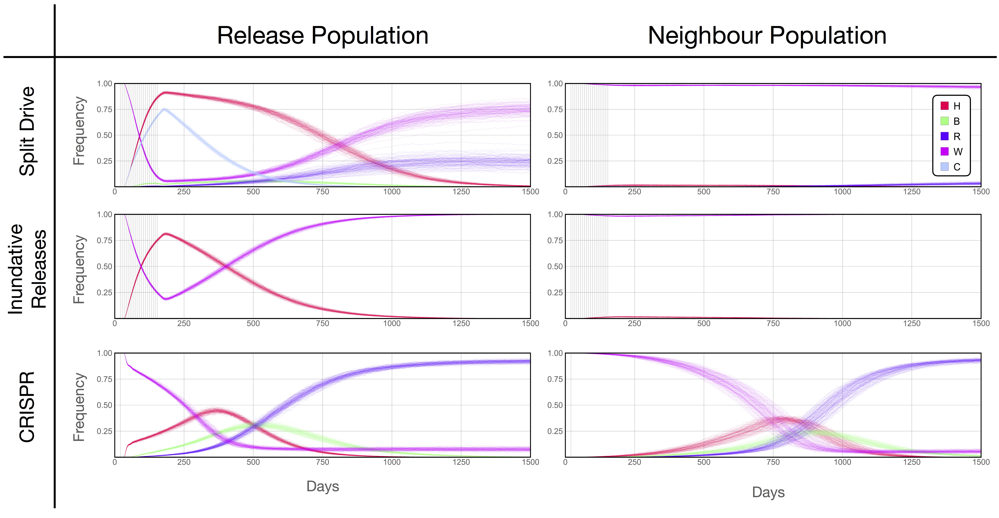

# Publication-Ready

Getting the figures to a "print-ready" state is the most frustrating and time consuming part of the "design" process. This involves the iterative process of refining details, exporting, and verifying it meets the functionality, format and aesthetic requirements for its use in a scientific document.

 

## Software

When thinking about editing images, [Photoshop](https://www.adobe.com/products/photoshop.html?sdid=KKQIN&mv=search&ef_id=EAIaIQobChMIqpmrrsL93gIVIRh9Ch2bcwxtEAAYASAAEgLfifD_BwE:G:s&s_kwcid=AL!3085!3!301413807965!e!!g!!photoshop) is probably the first software to come to mind. [GIMP](https://www.gimp.org/) is a free alternative to Photoshop, which incorporates most of the same features. However, for arranging figures in grids, and making slight adjustments to labels, we can usually get away with using [Powerpoint](https://office.live.com/start/PowerPoint.aspx), [Keynote](https://www.apple.com/keynote/) or even [Google Slides](https://www.google.com/slides/about/) to make our lives easier.

## Tips and Tricks

* Use the software you're the most comfortable with
* Try to work with vector-based formats for as long as possible
* Delay exporting frame labels until the end (possibly add them in "detailing" phases)
* Do not modify plot elements
* Try to use fonts and colors in a consistent way

## Journal Requirements

### [Plos](https://journals.plos.org/plosone/s/figures)

* File Format: TIFF or EPS
* Dimensions: Width: 789 – 2250 pixels (at 300 dpi). Height maximum: 2625 pixels (at 300 dpi).
* Resolution: 300 – 600 dpi
* File Size: <10 MB
* Text within Figures: Arial, Times, or Symbol font only in 8-12 point
* Save with LZW compression.

### [IEEE Journal](https://www.ieee.org/content/dam/ieee-org/ieee/web/org/pubs/eic-guide.pdf)

* EPS, PS, TIFF, PDF.
* 400 dpi

### [Information Fusion](https://www.elsevier.com/journals/information-fusion/1566-2535/guide-for-authors)

* EPS (or PDF): Vector drawings, embed all used fonts.
* TIFF (or JPEG): Color or grayscale photographs (halftones), keep to a minimum of 300 dpi.
* TIFF (or JPEG): Bitmapped (pure black & white pixels) line drawings, keep to a minimum of 1000 dpi.
* TIFF (or JPEG): Combinations bitmapped line/half-tone (color or grayscale), keep to a minimum of 500 dpi.
* PDF
