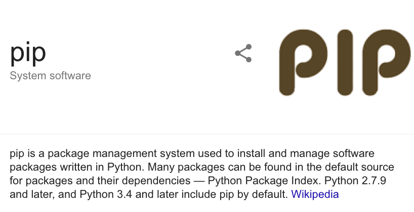
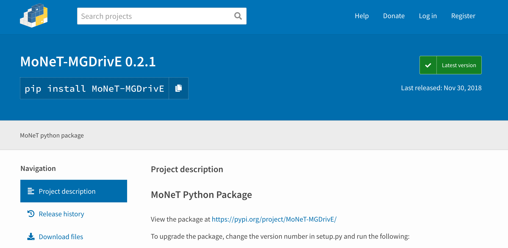
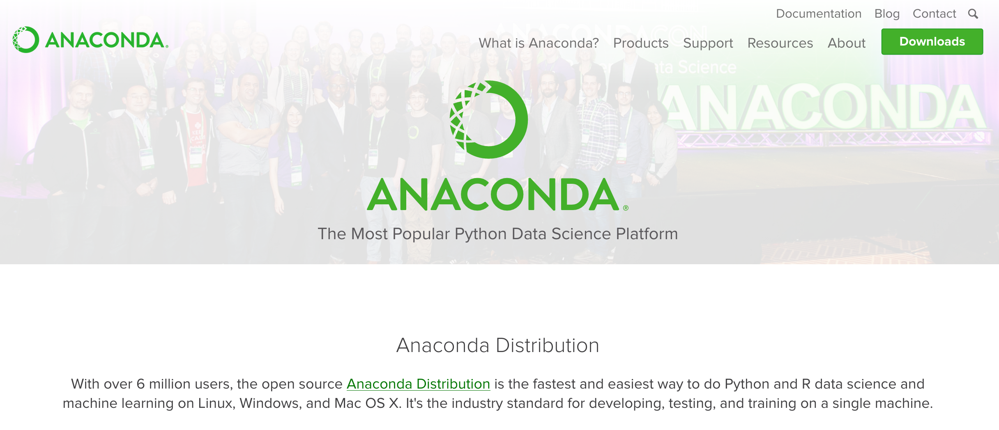

# Python

Python is an extremely versatile scripting language with extensive community support. Some of the advantages of using Python are:

* Standard Libraries
* Third-Party Libraries ([pip](https://pypi.org/project/pip/))
* Open Source
* User-Friendly Data Structures
* Easy to learn syntax
* Productivity
* Speed

<br>
<a href="https://pypi.org/project/pip/">

<hr>

#  PIP

The most famous package management system for python software distribution. Can be used in conjunction with [Anaconda](https://www.anaconda.com/) and [VirtualEnv](https://virtualenv.pypa.io/en/latest/) to create virtual environments for ease of package installation, collision prevention, and distribution.

<a href="https://pypi.org/project/pip/"></a><a href="https://pypi.org/project/MoNeT-MGDrivE/"></a>

<hr>

#  [Anaconda](https://www.anaconda.com/download/)



Installing packages in the [Anaconda cloud](https://anaconda.org/anaconda/repo) is easy:

```bash
conda install PACKAGENAME
```

For example, if we want to install [tensorflow](https://www.tensorflow.org/):

```bash
conda install -c conda-forge tensorflow
```


<hr>

```bash
pip install numpy
pip install plotly
pip install spyder
```
