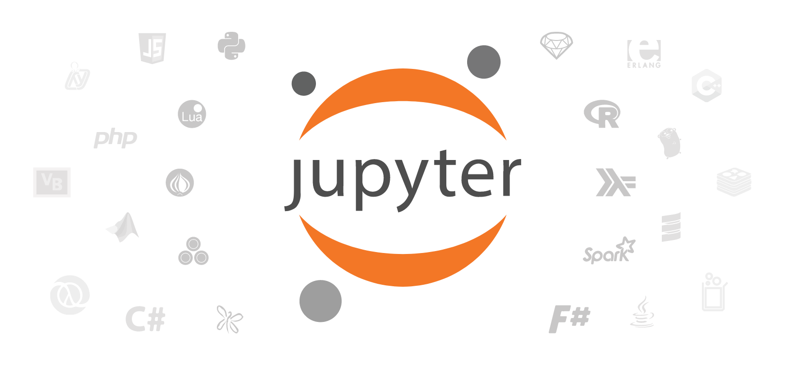

# Python

Python is an extremely versatile scripting language with extensive community support. Some of the advantages of using Python are:

* Standard Libraries
* Third-Party Libraries ([pip](https://pypi.org/project/pip/))
* Open Source
* User-Friendly Data Structures
* Easy to learn syntax
* Productivity
* Speed

<br>
<a href="https://pypi.org/project/pip/">

<hr>

# [Jupyter](http://jupyter.org/)

Jupyter is a cross-platform and cross-language project for interactive computing.



An example of R running in jupyter:

<a href="https://mybinder.org/v2/gh/binder-examples/r/master?filepath=index.ipynb"></a>

<hr>

#  [PIP](https://pypi.org/project/pip/)

The most famous package management system for python software distribution. Can be used in conjunction with [Anaconda](https://www.anaconda.com/) and [VirtualEnv](https://virtualenv.pypa.io/en/latest/) to create virtual environments for ease of package installation, collision prevention, and distribution.

<a href="https://pypi.org/project/pip/"></a><a href="https://pypi.org/project/MoNeT-MGDrivE/"></a>

If we wanted to setup the libraries required in the course's examples we can run (on the terminal):

```bash
pip install numpy
pip install plotly
pip install spyder
```

<hr>

# [VirtualEnv](https://virtualenv.pypa.io/en/latest/)

An easy way to deal with dependencies and libraries clashes is to generate a self-contained environment for each of our projects. These environments will hold the libraries (in their current versions) so that we do not break other projects, or require changes every time a library is updated.


<hr>

#  [Anaconda](https://www.anaconda.com/download/)


Installing packages in the [Anaconda cloud](https://anaconda.org/anaconda/repo) is easy:

```bash
conda install PACKAGENAME
```

For example, if we want to install [tensorflow](https://www.tensorflow.org/):

```bash
conda install -c conda-forge tensorflow
```

For instructions on how to install the required conda environment from anaconda, please follow the instructions on the [introduction](./intro.md).

## Setting Up the Course's Environment in Anaconda (the user-friendly way)

Download and install [Anaconda](https://www.anaconda.com/download/):


Open the Anaconda Navigator:


Once the Navigator is Open:


click on the Environments section:


and then import:


Locate the __./conda/dataViz.yml__ file in the project's repository, name it *dataViz* and click import. The environment should now be ready for use in our computers.

## Setting up the Course's Environment in Anaconda + Atom (the not-so-user-friendly way)

To setup the anaconda environment directly in the atom text editor follow the instructions detailed in the [dataViz conda environment readme file](../conda/README.md).

<a href="https://blog.atom.io/2017/11/15/code-together-in-real-time-with-teletype-for-atom.html"></a>
