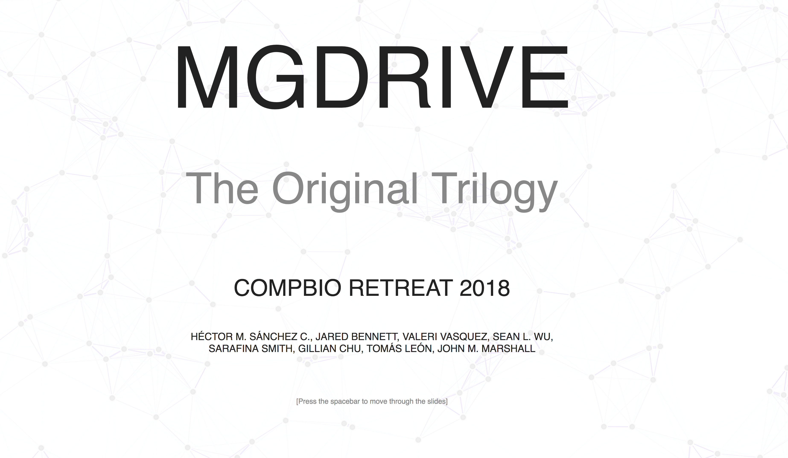

# [Reveal.JS](https://revealjs.com/#/)

This is a javascript framework to create presentations in HTML. It is extremely flexible, and it can be used through its HTML interface, or its [online editor](https://slides.com/?ref=github). Knowledge of [HTML](https://en.wikipedia.org/wiki/HTML) and [CSS](https://en.wikipedia.org/wiki/Cascading_Style_Sheets) is highly recommended to use the code version directly, although it does not need to be very advanced to produce acceptable results (several [CSS](https://en.wikipedia.org/wiki/Cascading_Style_Sheets) templates are provided by the authors). The framework also provides several [examples of use](https://github.com/hakimel/reveal.js/wiki/Example-Presentations) available online.

<hr>

<a href="https://chipdelmal.github.io/MGDrivE_Presentations/IDD2018/#/"></a>

```HTML
<!doctype html>
<html>
	<head>
		<meta charset="utf-8">
		<meta name="viewport" content="width=device-width, initial-scale=1.0, maximum-scale=1.0, user-scalable=no">
		<meta name="author" content="chipdelmal">
		<title>MGDrivE @ CompBio2018</title>
		<link rel="stylesheet" href="css/reveal.css">
		<link rel="stylesheet" href="css/theme/white.css">

		<!-- Theme used for syntax highlighting of code -->
		<link rel="stylesheet" href="lib/css/zenburn.css">

		<!-- Printing and PDF exports -->
		<script>
			var link = document.createElement( 'link' );
			link.rel = 'stylesheet';
			link.type = 'text/css';
			link.href = window.location.search.match( /print-pdf/gi ) ? 'css/print/pdf.css' : 'css/print/paper.css';
			document.getElementsByTagName( 'head' )[0].appendChild( link );
		</script>
	</head>
	<body>
		<div class="reveal">
			<div class="slides">
				<!--------------------------------------------------------------------->
				<!--------------------------------------------------------------------->
				<section data-background="./images/background.png">
					<section>
						<h1 style="font-size:150px">MGDrivE</h1><br>
						<pLight style="font-size:75px">The Original Trilogy</pLight><br><br><br>
						<h1 style="font-size:40px">CompBio Retreat 2018</h1><br>
						<h1 style="font-size:17.5px">Héctor M. Sánchez C., Jared Bennett, Valeri Vasquez, Sean L. Wu,<br> Tomás León, Sarafina Smith, Gillian Chu, John M. Marshall</h1><br>
						<!--<pLight style="line-height: .5; font-size:17.5px;">Contact: <a href="mailto:sanchez.hmsc@berkeley.edu">sanchez.hmsc@berkeley.edu</a> Website: <a href="https://marshalllab.github.io/MGDrivE/">https://marshalllab.github.io/MGDrivE/</a></pLight><br><br>-->
						<pLight style="font-size:12.5px">[Press the spacebar to move through the slides]</pLight>
					</section>
					<section>
						<h1>Agenda</h1><br>
						<pLight>
							Prologue<br><br>
							<b>Episode IV</b>: The Code Wars<br>
							<b>Episode V</b>: The Australian Menace<br>
							<b>Episode VI</b>: The Revenge of the Mutagenic Chain Reaction<br><br>
							Epilogue
						</pLight>
					</section>
				</section>
				<!--------------------------------------------------------------------->
				<!--------------------------------------------------------------------->
				<section data-background="./images/background.png">
					<section>
						<h1 style="font-size:70px">Prologue</h1><br>
						<pLight>
							1. Know Thy Enemy<br>
							2. MGDrivE<br>
						</pLight>
					</section>
					<section>
						<h1 style="font-size:55px">P-1. Know thy Enemy</h1>
						
					</section>
					<section>
						<h1 style="font-size:60px">P-2. MGDrivE</h1><br>
						
					</section>
				</section>
				<!--------------------------------------------------------------------->
				<!--------------------------------------------------------------------->
				<section data-background="./images/background.png">
					<section>
						<h1 style="font-size:70px">Episode IV: The Code Wars</h1><br>
						<pLight>
							1. Resistance is not Futile<br>
							2. Stochastic Focusing<br>
							3. Advertisement
						</pLight>
					</section>
					<section>
						<h1 style="font-size:60px">IV-1. Resistance is not Futile</h1><br>
						<video data-autoplay width=100%><source src="./videos/CRISPR_FR02.mp4" type="video/mp4"></video>
					</section>
					<section>
						<h1 style="font-size:60px">IV-2. Stochastic Focusing</h1><br>
						
					</section>
					<section>
						<h1 style="font-size:60px">IV-2. Stochastic Focusing</h1><br>
						
					</section>
					<section>
						<h1 style="font-size:60px">IV-3. Advertisement</h1><br>
						<br>
					</section>
				</section>
				</section>
			</div>
		</div>
		<script src="lib/js/head.min.js"></script>
		<script src="js/reveal.js"></script>
		<script>w3.includeHTML();</script>
		<script>
		// More info https://github.com/hakimel/reveal.js#configuration
		Reveal.initialize({
			controls: false,
			progress: false,
			history: true,
			center: true,
			transition: 'slide', // none/fade/slide/convex/concave/zoom
			// More info https://github.com/hakimel/reveal.js#dependencies
			math: {
				mathjax: 'https://cdnjs.cloudflare.com/ajax/libs/mathjax/2.7.0/MathJax.js',
				config: 'TeX-AMS_HTML-full'  // See http://docs.mathjax.org/en/latest/config-files.html
			},
			dependencies: [
				{src:'lib/js/classList.js', condition: function() { return !document.body.classList;}},
				{src:'plugin/markdown/marked.js', condition: function() { return !!document.querySelector( '[data-markdown]' );}},
				{src:'plugin/markdown/markdown.js', condition: function() { return !!document.querySelector( '[data-markdown]' );}},
				{src:'plugin/highlight/highlight.js', async: true, callback: function() { hljs.initHighlightingOnLoad();}},
				{src:'plugin/zoom-js/zoom.js', async: true},
				{src:'plugin/notes/notes.js', async: true},
				{src: 'plugin/math/math.js', async: true}
			]
		});
		</script>
	</body>
</html>
```

<hr>

## [MathJax](https://www.mathjax.org/)

Another feature of this framework is that it can work seamlessly with MathJax to display sharp equations in any kind of display. We just need to add the following code to the tail section of the HTML:

```html
<script src="lib/js/head.min.js"></script>
	<script src="js/reveal.js"></script>
	<script>w3.includeHTML();</script>
	<script>
	// More info https://github.com/hakimel/reveal.js#configuration
	Reveal.initialize({
		controls: false,
		progress: false,
		history: true,
		center: true,
		transition: 'slide', // none/fade/slide/convex/concave/zoom
		// More info https://github.com/hakimel/reveal.js#dependencies
		math: {
			mathjax: 'https://cdnjs.cloudflare.com/ajax/libs/mathjax/2.7.0/MathJax.js',
			config: 'TeX-AMS_HTML-full'  // See http://docs.mathjax.org/en/latest/config-files.html
		},
		dependencies: [
			{src:'lib/js/classList.js', condition: function() { return !document.body.classList;}},
			{src:'plugin/markdown/marked.js', condition: function() { return !!document.querySelector( '[data-markdown]' );}},
			{src:'plugin/markdown/markdown.js', condition: function() { return !!document.querySelector( '[data-markdown]' );}},
			{src:'plugin/highlight/highlight.js', async: true, callback: function() { hljs.initHighlightingOnLoad();}},
			{src:'plugin/zoom-js/zoom.js', async: true},
			{src:'plugin/notes/notes.js', async: true},
			{src: 'plugin/math/math.js', async: true}
		]
	});
</script>
```

To be able to include equations in [LaTeX](https://www.latex-project.org/) format within our presentations:

```html
<!DOCTYPE html>
<html>
  <head>
    <title>MathJax example</title>
    <script type="text/javascript" async src="https://cdnjs.cloudflare.com/ajax/libs/mathjax/2.7.5/MathJax.js?config=TeX-MML-AM_CHTML" async>
    </script>
  </head>
  <body>
    <p>
      When \(a \ne 0\), there are two solutions to \(ax^2 + bx + c = 0\) and they are $$x = {-b \pm \sqrt{b^2-4ac} \over 2a}.$$
      </p>
  </body>
</html>
```

To see this rendered correctly follow the: [mathjax example](./Examples/mathjax.html)

<hr>

# Example

For an example/exercise of how to use the framework follow this [link](../scripts/revealjs/).
