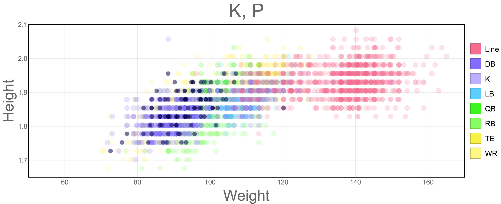

# Scatter

**Input:** *{x,y}* or *{x,y,z}* coordinates

## Scatter Plot

The most natural, and straightforward way to plot coordinates data is in a scatter plot. This idea, however, can be extended to contain more dimensions if we play with the colors hues and densities, as shown in [exercise 2](#exercise02).

##  Bubble Chart

Another extension of the scatter plot is a bubble chart, in which additional information can be added to both: the size of the points, and their color. [Exercise 1](#exercise01) shows an example of this.

## Scatter Plot with Histograms

An extension to a traditional scatter plot is the addition of histograms on the axes. This is particularly useful for spatial data, where the distribution of occurrences is important.

# Exercises

##  <a name="exercise01">[1) Bubble Chart (Python)](https://github.com/Chipdelmal/dataViz_CADi/tree/master/scripts/BubbleChart)</a>

In this exercise we create a bubble chart with information about a countries, their life expectancy and their fertility rates.

##  <a name="exercise02">[2) Scatter Plot (Mathematica)](https://github.com/Chipdelmal/dataViz_CADi/tree/master/scripts/ScatterPlot)</a>

This exercise shows how making slight changes in coloring and styling can help transmit large amounts of information in a single plot.

##  <a name="exercise02">[3) Scatter Plot with Histograms (Python)](https://github.com/Chipdelmal/dataViz_CADi/tree/master/scripts/ScatterPlot)</a>

This plotly example showcases how to plot an interactive scatter with histograms information on the sides.
