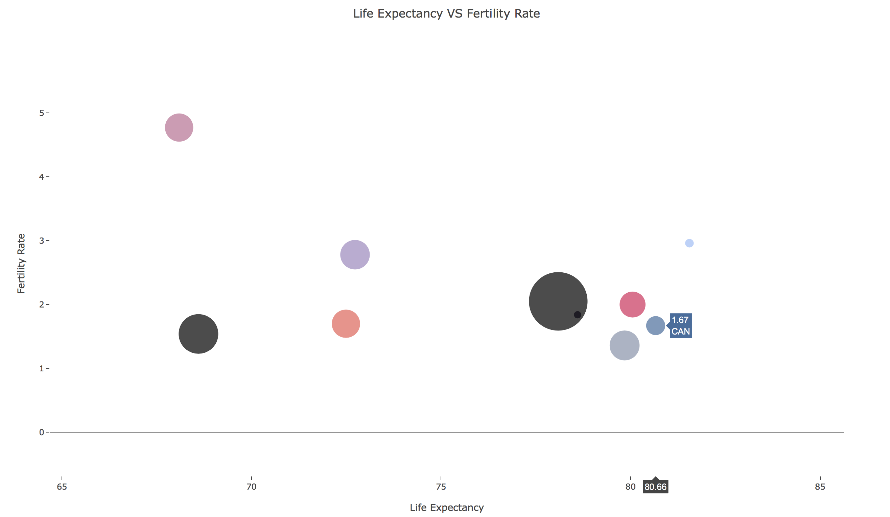

# Scatter

**Input:** *{x,y}* or *{x,y,z}* coordinates

Scatter data is common because its use in time series and correlation plots. This might make it seem like there are not a lot of options to make these plots interesting, but there are a couple of ways to make them stand out through the use of colors, size (bubble charts), and adding other elements like histograms.

## Scatter Plot

The most natural, and straightforward way to plot coordinates data is in a scatter plot. This idea, however, can be extended to contain more dimensions if we play with the colors hues and densities, as shown in [exercise 2](#exercise02).

##  Bubble Chart

Another extension of the scatter plot is a bubble chart, in which additional information can be added to both: the size of the points, and their color. [Exercise 1](#exercise01) shows an example of this.

## Scatter Plot with Histograms

An extension to a traditional scatter plot is the addition of histograms on the axes. This is particularly useful for spatial data, where the distribution of occurrences is important.

# Exercises

1.  <a name="exercise01">[Bubble Chart (Python)](https://github.com/Chipdelmal/dataViz_CADi/tree/master/scripts/BubbleChart)</a>
2.  <a name="exercise02">[Scatter Plot (Mathematica)](https://github.com/Chipdelmal/dataViz_CADi/tree/master/scripts/ScatterPlot)</a>
3.  <a name="exercise03">[Scatter Plot with Histograms (Python)](https://github.com/Chipdelmal/dataViz_CADi/tree/master/scripts/ScatterHistogram)</a>

# Gallery

#### NFL players heights VS weights by position

