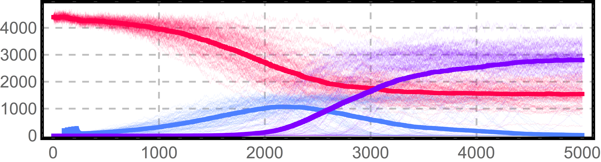
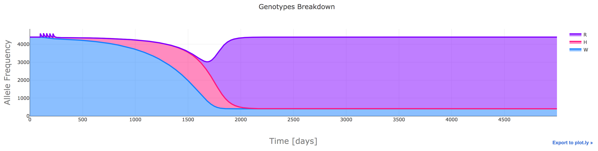

# Time Series

Time series data is extremely common amongst different fields.

##  Line Plots (connected scatter plots)

The baseline to which all other plots are compared to. This kind of graphic has the advantage of being easily interpretable by most audiences, and requires little explanation. By using thicknesses, and color palettes, we can differentiate traces and emphasize the most relevant information. In [exercise 1](#exercise01) we will see how changing these variables can help us transmit large amounts of information in a meaningful way.

 

##  Stream Chart (stacked area)

##  Dygraph

##  Heatmap

# Exercises

##  <a name="exercise01">[1) Stochastic Traces (Mathematica)](https://github.com/Chipdelmal/dataViz_CADi/tree/master/Day01/scripts/TimeSeries)</a>

In this exercise, we will use the data from a stochastic simulation of three mosquito genotypes interactions in a spatial landscape. Starting from datasets containing 50 repetitions of a stochastic experiment, we will create the following plot that allows the visualization of hundreds of traces, along with their mean in an easy to read format.

 

  <a href="https://github.com/Chipdelmal/dataViz_CADi/tree/master/Day01/scripts/TimeSeries">
    

  </a>

 

##  [2) Stacked Area (R, Python)](https://github.com/Chipdelmal/dataViz_CADi/tree/master/Day01/scripts/StackedArea)

In this exercise, we will use the aggregated data from a deterministic simulation of three mosquito genotypes interactions in a spatial landscape. We will generate the stacked area chart of the information in _plotly_ to create an interactive version of the dataset.

 

  <a href="https://github.com/Chipdelmal/dataViz_CADi/tree/master/Day01/scripts/StackedArea">
    

  </a>

 

##  [3) Dygraph (R)](https://github.com/Chipdelmal/dataViz_CADi/tree/master/Day01/scripts/Dygraph)

This exercise shows how to create a "dygraph" for time series data with R.

 

  <a href="https://github.com/Chipdelmal/dataViz_CADi/tree/master/Day01/scripts/Dygraph">
    

  </a>

 

# Extensions and Gallery

## Dissecting a mosquito life history

   

## Displaying spatio-temporal processes in a landscape

   

## Using Color Transparency to show spatio-temporal processes in a single plot

   

<iframe scrolling="no" src="https://plot.ly/~chipdelmal/0.embed?height=1000" width="100%""></iframe>
