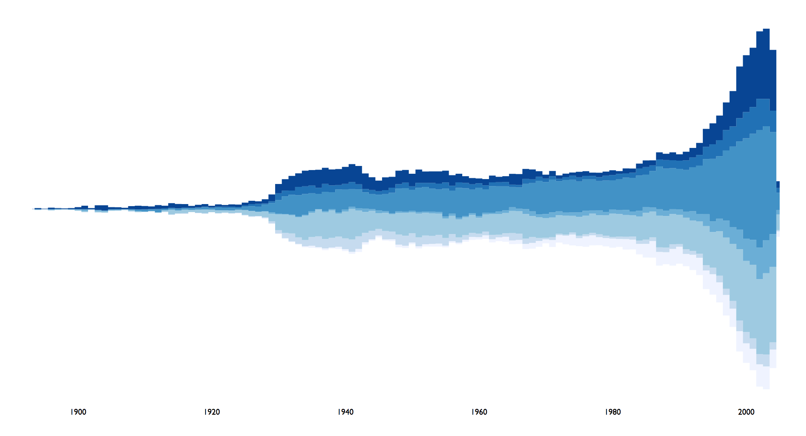
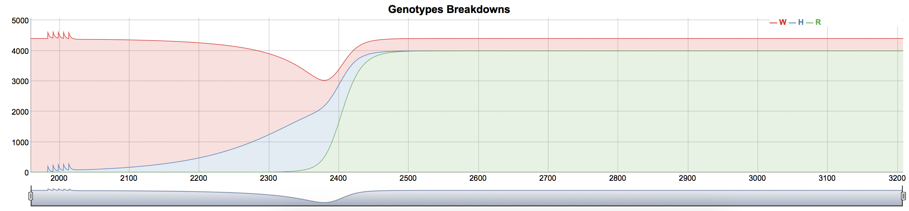
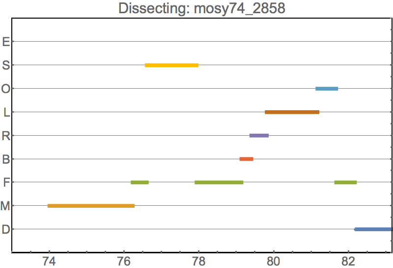
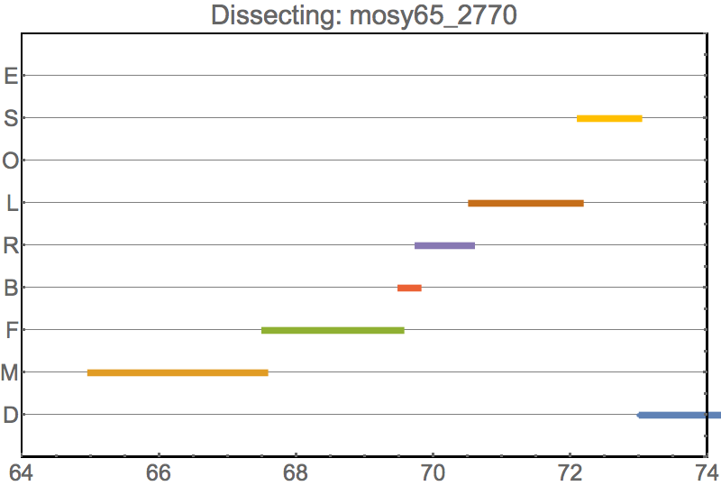
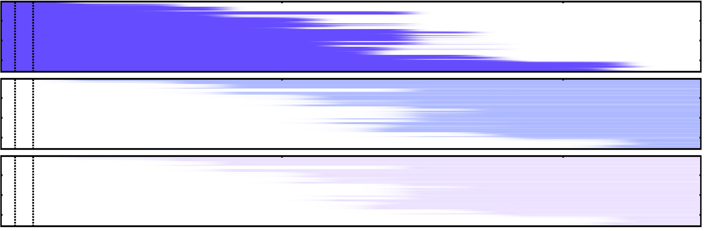
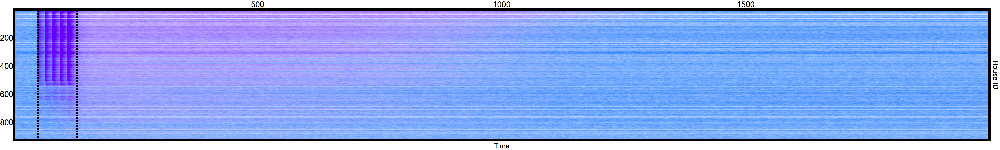

# Time Series

__Data type:__ counts varying over time.

Time series data is extremely common amongst different fields, as such, almost every audience knows how to interpret it at a glance. This might make us think that there's not much innovation or many options to make our plots stand out, but in this section we will see how to make some effective uses of color space and plot types to do so.

##  Line Plots (connected scatter plots)

The baseline to which all other plots are compared to. This kind of graphic has the advantage of being easily interpretable by most audiences, and requires little explanation. By using thicknesses, and color palettes, we can differentiate traces and emphasize the most relevant information. In [exercise 1](#exercise01) we will see how changing these variables can help us transmit large amounts of information in a meaningful way.

 

##  Stream Chart (stacked area)

In [exercises 2](#exercise02) and [4](#exercise04) we will see how to create these plots both in _R_ and _Python_.

<!---->

##  Dygraph

Often used in economics, this plot shows us counts ofer time, along with the time information (on the bottom) as an interactive selector of the ranges to inspect. [Exercise 3](#exercise03) will show us how to create a dygraph in _R_.

 

##  Heatmap

# Exercises

1. <a name="exercise01">[Stochastic Traces (Mathematica)](../scripts/TimeSeries)</a>
2. <a name="exercise02">[Stacked Area (R, Python)](../scripts/StackedArea)</a>
3. <a name="exercise03">[Dygraph (R)](../scripts/Dygraph)</a>
4. <a name="exercise04">[Streamchart (R)](../scripts/Streamgraph)

# Extensions and Gallery

#### Dissecting a mosquito life history

 

#### Displaying spatio-temporal processes in a landscape

 

#### Using Color Transparency to show spatio-temporal processes in a single plot

 
