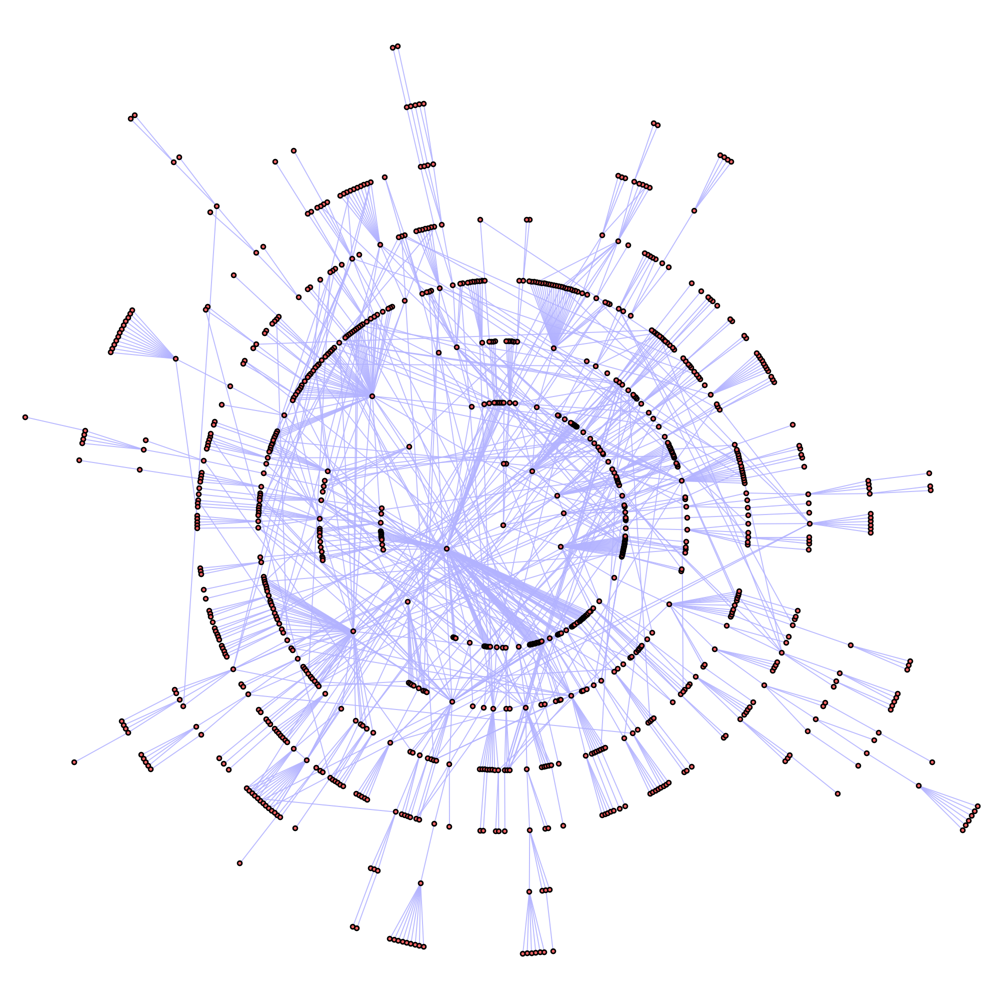

# Transitions Data

**Input data:** Transition matrices/Edges lists

Information about transitions is easily represented in different formats. In terms of information transmission contexts, it is customary to represent the data in a network form. In biological contexts, however, these data are more traditionally shown in heatmaps or chord diagrams. It is, therefore, a good practice to be comfortable with representing data in these three formats, as it might give some additional insight to patterns, and correlations.

## Heatmap

Even they might not seem like the most natural representation of transitions data, heatmaps provide a fairly concise way to highlight patterns, and make comparisons between processes and experiments.

 

## Network

Any kind of transition data can me mapped into a network representation. This kind display has become much more prevalent in latest years due to the surge of interest in graph-theory applications. It might be tricky, though, to get a graph layout that conveys the information we want to transmit in the most efficient way possible.

##  Chord Diagram

Frequently used in genetic analyses. It represents the states around a circle, and the transitions in arrows that change in width proportionally to frequency.

<!--## Sankey Diagram

[networkD3 (R)](https://www.r-graph-gallery.com/sankey-diagram/)-->

# Exercises

1. <a name="exercise01">[Chord Diagram](./scripts/Circlize)</a>
1. <a name="exercise02">[Heatmap](./scripts/Transitions)</a>
1. <a name="exercise03">[Random Network](./scripts/NetworksRandom)</a>

# Gallery

##  Spread of SIR diseases in a network

 

##  Distribution of Feeding Sites and Movement Probabilities in a Landscape

