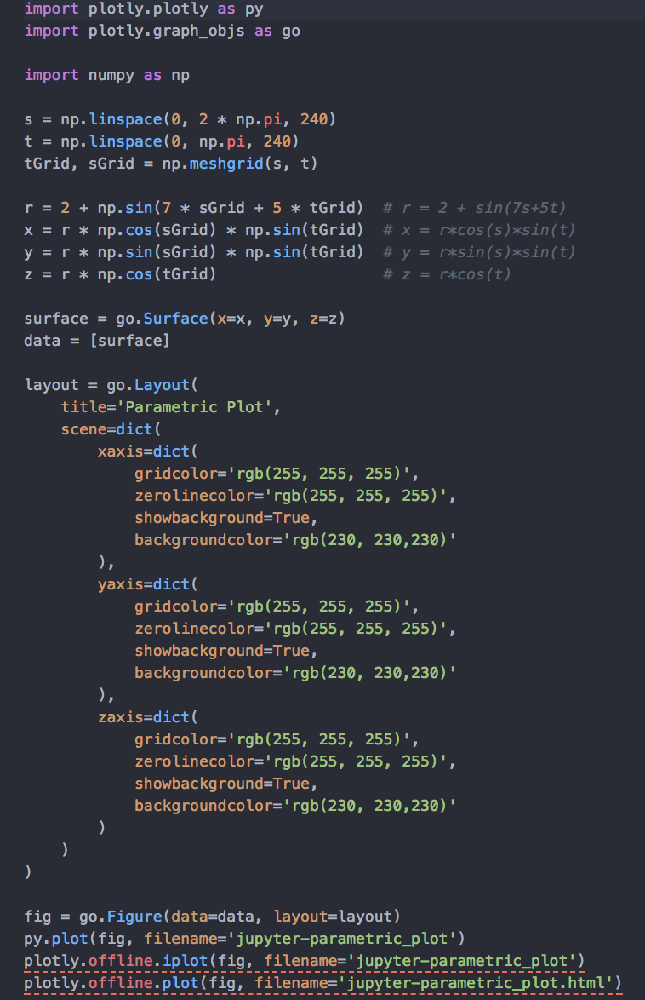

# dataViz CADi

This folder contains all the scripts used throughout the course. For a detailed description please follow the index in the [landing page of the repository](https://github.com/Chipdelmal/dataViz_CADi).

  
